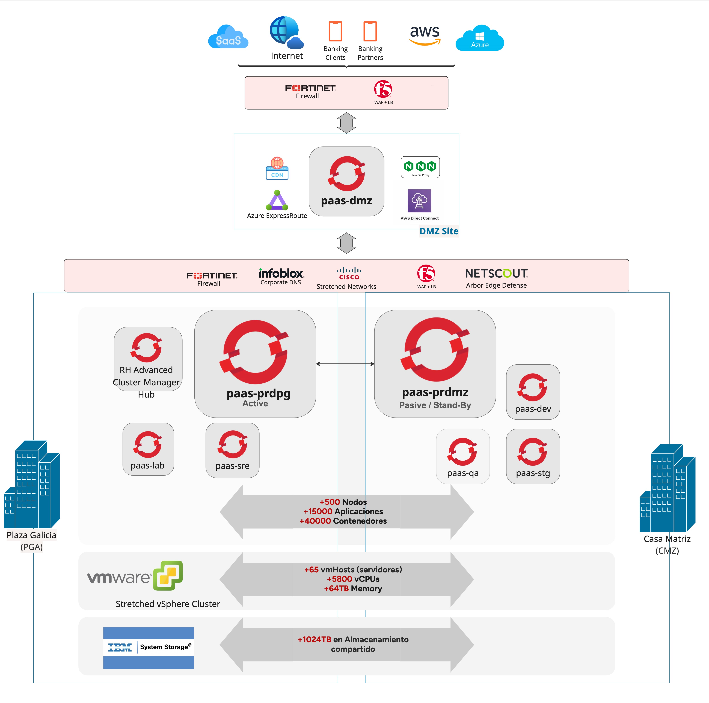
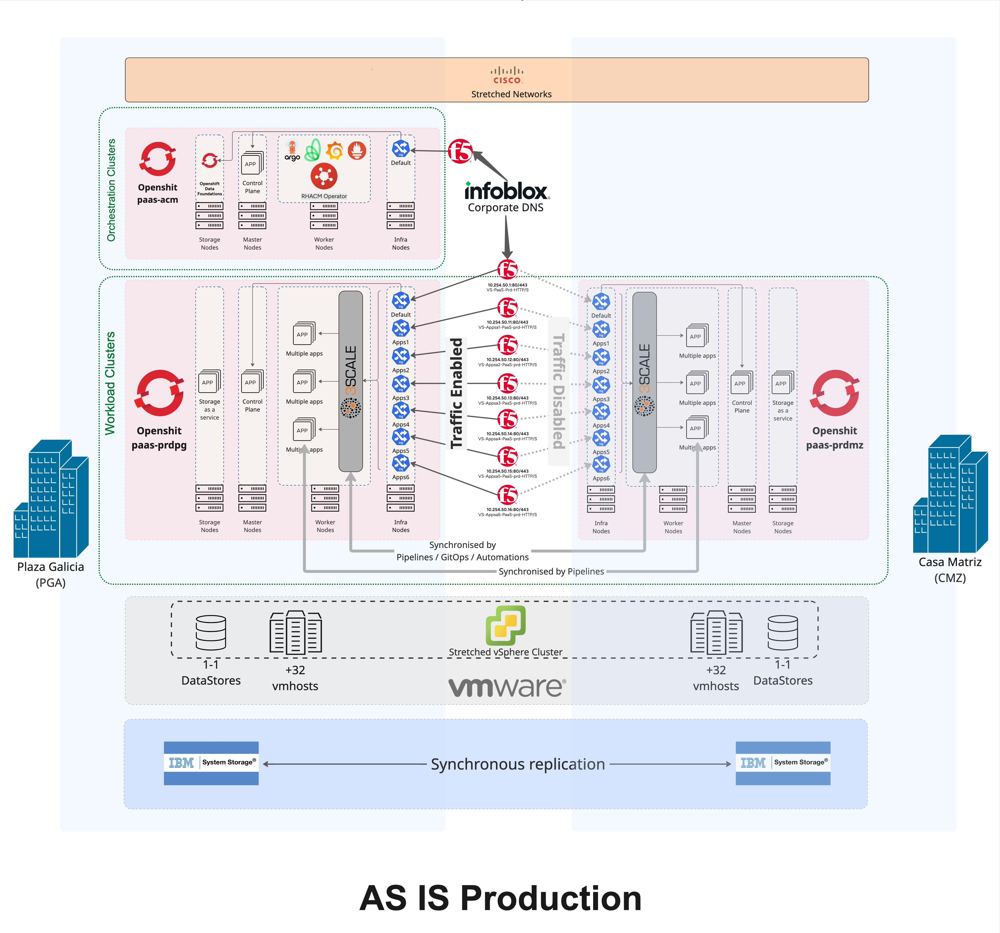
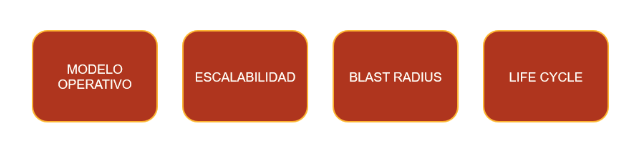
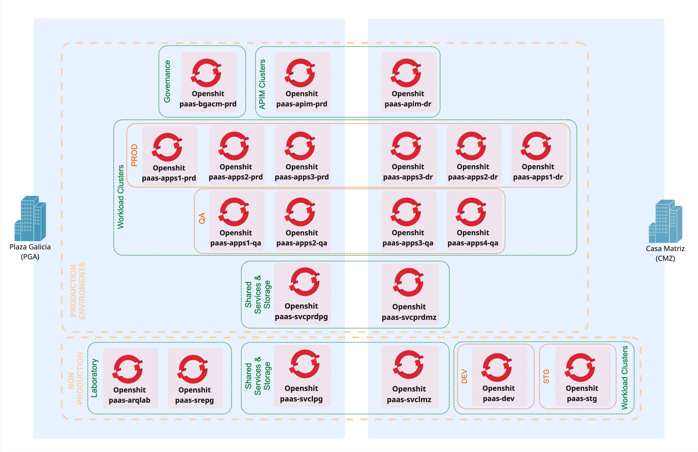
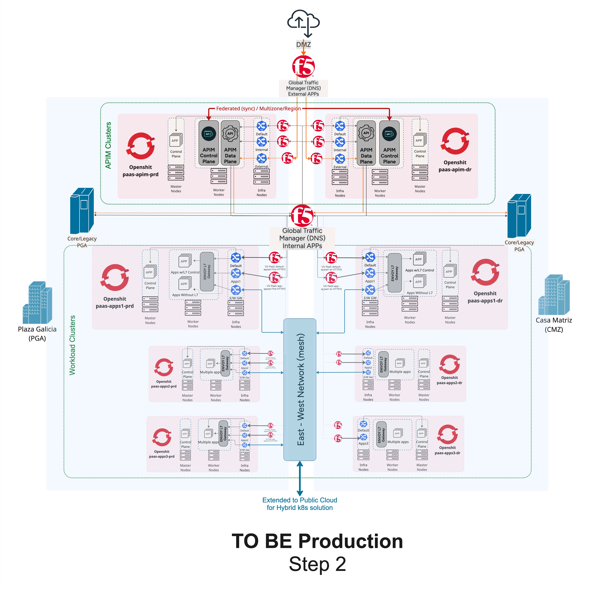
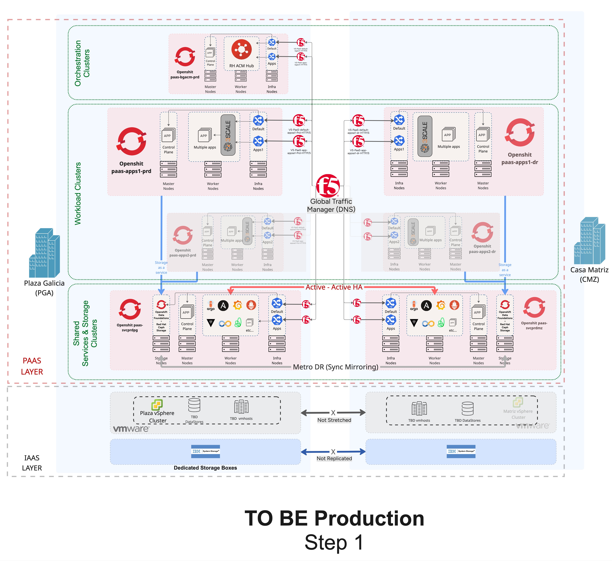
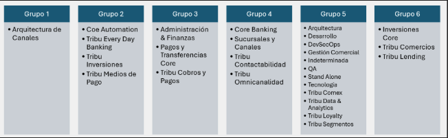

# Ingeniería de Plataforma

# Implementación de OCP Multicluster

## DEFINICIÓN DE ESTRATEGIA Y TOPOLOGÍA GENERAL DE COMPONENTES

| Metadato | Valor |
|----------|--------|
| **Versión** | 1.0 |
| **Fecha** | Marzo 2026 |
| **Autor/Responsable** | Ingeniería de Plataforma |
| **Clasificación** | Confidencial |

*Historial de cambios:* v1.0 (Mar 2026) — Versión inicial.

---

## Índice

1. [**Introducción y contexto**](#sec-1)
   - 1.1 Objetivo del documento
   - 1.2 Alcance y objetivo
   - 1.3 Resumen ejecutivo
   - 1.4 Riesgos de no evolucionar la plataforma
     - 1.4.1 Riesgo operativo y de continuidad
     - 1.4.2 Riesgo de escalabilidad y crecimiento
     - 1.4.3 Riesgo tecnológico y de obsolescencia
     - 1.4.4 Riesgo organizacional y operativo
     - 1.4.5 Riesgo estratégico

2. [**Situación actual**](#sec-2)
   - 2.1 Topología y capacidad (As-is)
   - 2.2 Limitaciones técnicas prioritarias
   - 2.3 Diagrama topológico de referencia actual

3. [**Arquitectura objetivo multicluster**](#sec-3)
   - 3.1 Segmentación de dominios y tipología de clusters
   - 3.2 Patrones de tráfico objetivo (Step 2 — north-south y east-west)
   - 3.3 Ingress/egress, DNS global y balanceo
   - 3.4 Modelo de control plane y data plane
   - 3.5 Seguridad integral multicluster
   - 3.6 Observabilidad federada y confiabilidad
   - 3.7 Modelo operativo objetivo

4. [**Decisiones arquitectónicas más relevantes**](#sec-4)

5. [**Estrategia de evolución multicluster (detalle por fases)**](#sec-5)
   - 5.1 Fase fundacional: habilitadores de plataforma
   - 5.2 Fase de sharding de ingreso y desacople de flujos
   - 5.3 Fase de segmentación operativa y gobierno
   - 5.4 Consolidacion y madurez del proceso de movimiento de cargas
   - 5.5 Implementación y migración al nuevo APIM
   - 5.6 Fase de consolidación de patrones de alta disponibilidad

6. [**Arquitectura y topología objetivo — Primera etapa (H1)**](#sec-6)
   - 6.1 Vista general — Step 1 (H1)
   - 6.2 Fundamentales, habilitadores y automatización day 0 / day 1 / day 2
   - 6.3 Consolidación del ingress sharding
   - 6.4 IaaS dedicado por sitio
   - 6.5 Nuevo modelo de tráfico con F5 GTM
   - 6.6 Dominios de clusters y separación de responsabilidades
   - 6.7 Estrategia de acomodo de cargas por tribu/dominio
   - 6.8 Esquema de alta disponibilidad y tráfico interno en H1
   - 6.9 Despliegue de observabilidad e2e mediante eBPF

7. [**Plan de ejecución high-level**](#sec-7)
   - 7.1 Entregables de control ejecutivo

8. [**Riesgos críticos y mitigaciones del programa multicluster**](#sec-8)

9. [**Conclusión**](#sec-9)

10. [**Referencias a documentación detallada (@arquitectura)**](#sec-10)
    - 10.1 Índice y visión general
    - 10.2 Estado actual y diagnóstico (as-is)
    - 10.3 Arquitectura objetivo y decisiones
    - 10.4 Evolución, operación y ejecución
    - 10.5 Seguridad, cumplimiento y observabilidad
    - 10.6 Documentación APIM (modernización de infraestructura API)

---

## 1. Introducción y contexto

### 1.1 Objetivo del documento

El objetivo del presente documento es describir la situación actual del Banco Galicia en el uso y operación de la plataforma OpenShift. Mediante este análisis se identifican una serie de definiciones relacionadas a la evolución de esta tecnología y soportadas sobre las pruebas realizadas por el equipo en la investigación y desarrollo de nuevos paradigmas de uso y ejecución de microservicios. Como resultado final se detalla un plan de alto nivel de ejecución de iniciativas que permitirán alcanzar el objetivo final [1](https://github.bancogalicia.com.ar/ocpa/apim-doc/blob/master/02_multi-cluster/indice_tentativo.md), [2](https://github.bancogalicia.com.ar/ocpa/apim-doc/blob/master/02_multi-cluster/vision_estrategia_multicluster.md).

### 1.2 Alcance y objetivo

La reingeniería de nuestra plataforma OpenShift (OCP) tiene como objetivo rediseñar, modernizar y optimizar la arquitectura, los componentes y los procesos operativos que sostienen la estructura de contenedores del Banco Galicia. Esta iniciativa busca asegurar la escalabilidad futura para cubrir las necesidades de la organización, soportando el crecimiento de cargas críticas, los modelos multicluster y los requisitos de disponibilidad y resiliencia exigidos por la industria financiera.

El objetivo principal es evolucionar la plataforma desde su estado actual hacia un modelo que garantice 7 aspectos [18](https://github.bancogalicia.com.ar/ocpa/apim-doc/blob/master/02_multi-cluster/05_principios_arquitectura_criterios_diseno/5.1_estandarizacion_y_automatizacion_por_defecto.md), [19](https://github.bancogalicia.com.ar/ocpa/apim-doc/blob/master/02_multi-cluster/05_principios_arquitectura_criterios_diseno/5.2_escalabilidad_horizontal_y_elasticidad.md), [20](https://github.bancogalicia.com.ar/ocpa/apim-doc/blob/master/02_multi-cluster/05_principios_arquitectura_criterios_diseno/5.3_resiliencia_multicluster_y_alta_disponibilidad.md), [21](https://github.bancogalicia.com.ar/ocpa/apim-doc/blob/master/02_multi-cluster/05_principios_arquitectura_criterios_diseno/5.4_seguridad_by_design_y_zero_trust.md), [22](https://github.bancogalicia.com.ar/ocpa/apim-doc/blob/master/02_multi-cluster/05_principios_arquitectura_criterios_diseno/5.5_observabilidad_integral_y_operabilidad.md):

1. **Mayor eficiencia operativa** mediante automatización, estandarización y uso de un stack de tecnologías que construyan un framework.
2. **Escalabilidad y elasticidad** para soportar múltiples dominios de negocio y picos de transaccionalidad/demanda.
3. **Alta disponibilidad y resiliencia** mediante topologías multicluster y prácticas estándares de mercado que minimicen el impacto cruzado de fallas.
4. **Reducir la complejidad técnica** y eliminar componentes legacy sin evolución y con proyección de tecnologías fuera de soporte.
5. **Mejorar la experiencia del desarrollo** habilitando esquemas de seguridad y comunicación más controlados que permitan darle mejor trazabilidad al consumo de servicios internos como externos.
6. **Fortalecer la postura de ciberseguridad** bajo estándares de la industria bancaria.
7. **Implementar capacidades de observabilidad integral** para una operación más proactiva.

### 1.3 Resumen ejecutivo

Un único cluster productivo concentra hoy cargas críticas de múltiples líneas de negocio, con alto volumen transaccional y fuerte dependencia de procesos manuales. Este diseño amplifica el blast radius ante fallas, extiende las ventanas de mantenimiento y limita la elasticidad real. El API Manager (3scale) tiene fin de vida en 2027, lo que obliga a actuar con anticipación. La transformación no es solo el reemplazo puntual de APIM: es la evolución desde un esquema monolítico hacia una arquitectura multicluster con gobierno central y operación por dominios.

La estrategia objetivo define una colección de clusters con responsabilidades claras, segmentación por criticidad y tipo de servicio, patrones diferenciados para tráfico north-south y east-west, y un modelo operativo GitOps + IaC (day 0 / day 1 / day 2). El API Manager se utiliza como caso piloto para validar decisiones de red, seguridad, resiliencia y operación que luego se extienden al resto de OpenShift. El beneficio esperado es reducir el impacto cruzado ante incidentes, mejorar la continuidad operativa y sostener el crecimiento del negocio sin incrementar la complejidad en la misma proporción.

Se recomienda avanzar con la estrategia multicluster en fases a partir de los habilitadores definidos en este documento. El detalle y las referencias se desarrollan en las secciones 2–7 y en la documentación enlazada en la sección 10. Su lectura de este documento refleja su interés como pieza clave y colaborador necesario para el éxito del programa; su aporte y alineación son fundamentales para llevarlo adelante.

### 1.4 Riesgos de no evolucionar la plataforma

La permanencia del modelo actual de OpenShift monolítico activo-pasivo no es neutra. Implica aceptar una serie de riesgos estructurales que aumentan en forma proporcional al crecimiento del negocio, la transaccionalidad y la criticidad de los servicios digitales.

#### 1.4.1 Riesgo operativo y de continuidad [11](https://github.bancogalicia.com.ar/ocpa/apim-doc/blob/master/02_multi-cluster/04_diagnostico_problemas_deuda_tecnica/4.1_riesgo_sistemico_y_blast_radius.md), [14](https://github.bancogalicia.com.ar/ocpa/apim-doc/blob/master/02_multi-cluster/04_diagnostico_problemas_deuda_tecnica/4.4_brechas_de_resiliencia_y_recuperacion_ante_desastres.md)

- La concentración de cargas críticas en un único clúster amplifica el blast radius ante fallas de infraestructura, red, storage o configuración.
- Incidentes recientes evidencian que fallas parciales (storage, balanceo, red) tienen impacto transversal banco-wide, aun cuando no comprometen completamente el clúster.
- La continuidad depende de intervenciones manuales, coordinación entre múltiples equipos y ventanas operativas extensas, aumentando el RTO efectivo.

**IMPACTO:** mayor probabilidad de incidentes de alto impacto y mayor tiempo de recuperación frente a fallas.

#### 1.4.2 Riesgo de escalabilidad y crecimiento [12](https://github.bancogalicia.com.ar/ocpa/apim-doc/blob/master/02_multi-cluster/04_diagnostico_problemas_deuda_tecnica/4.2_limites_de_escalabilidad_y_elasticidad.md), [6](https://github.bancogalicia.com.ar/ocpa/apim-doc/blob/master/02_multi-cluster/03_estado_actual_plataforma_openshift/3.4_gestion_de_apis_y_estado_de_apim.md)

- El clúster monolítico actúa como unidad indivisible de escalado, limitando la elasticidad real ante crecimiento por dominios.
- Límites técnicos y operativos en: cantidad de rutas, densidad de APIs, recargas no dinámicas de componentes de ingreso/APIM.
- El hair-pinning de tráfico interno penaliza latencia y eficiencia transaccional.

**IMPACTO:** el crecimiento futuro se vuelve cada vez más costoso, complejo y riesgoso.

#### 1.4.3 Riesgo tecnológico y de obsolescencia [6](https://github.bancogalicia.com.ar/ocpa/apim-doc/blob/master/02_multi-cluster/03_estado_actual_plataforma_openshift/3.4_gestion_de_apis_y_estado_de_apim.md), [26](https://github.bancogalicia.com.ar/ocpa/apim-doc/blob/master/02_multi-cluster/06_alternativas_tecnologicas_evaluadas/6.2_alternativas_de_api_management_y_api_gateway.md)

- El modelo actual mantiene dependencias fuertes con componentes sin evolución clara.
- 3scale presenta fin de vida en 2027, generando un riesgo cierto de continuidad si no se anticipa su reemplazo.
- Postergar la reingeniería fuerza una migración reactiva, bajo presión de tiempo, con mayor riesgo técnico y operativo.

**IMPACTO:** pérdida de margen de decisión tecnológica y aumento del riesgo de transición forzada.

#### 1.4.4 Riesgo organizacional y operativo [13](https://github.bancogalicia.com.ar/ocpa/apim-doc/blob/master/02_multi-cluster/04_diagnostico_problemas_deuda_tecnica/4.3_complejidad_operativa_y_tareas_manuales.md), [40](https://github.bancogalicia.com.ar/ocpa/apim-doc/blob/master/02_multi-cluster/07_arquitectura_objetivo_plataforma/7.7_modelo_operativo_gitops_iac.md), [48](https://github.bancogalicia.com.ar/ocpa/apim-doc/blob/master/02_multi-cluster/09_modelo_operativo_experiencia_desarrollo/9.1_operating_model_de_plataforma_roles_ownership_capacidades.md)

- La alta manualidad y la coexistencia de automatización parcial generan: variabilidad operativa, dependencia de conocimiento tácito, dificultad para escalar equipos y responsabilidades.
- El modelo actual limita la adopción efectiva de GitOps, IaC y operación por dominios.

**IMPACTO:** mayor carga operativa, mayor probabilidad de error humano y menor velocidad de entrega.

#### 1.4.5 Riesgo estratégico [17](https://github.bancogalicia.com.ar/ocpa/apim-doc/blob/master/02_multi-cluster/04_diagnostico_problemas_deuda_tecnica/4.7_complejidad_heredada_legacy_y_friccion_para_equipos_de_desarrollo.md)

- Mantener el modelo actual implica seguir invirtiendo en una arquitectura con límites conocidos.
- Cada nuevo proyecto se apoya sobre una base que no reduce riesgo sistémico, sino que lo incrementa.
- La plataforma deja de ser un habilitador del negocio para convertirse en un factor restrictivo.

**IMPACTO:** pérdida de competitividad y menor capacidad de respuesta ante nuevas demandas del negocio.

La materialización de estos riesgos se mitiga con el programa descrito en secciones 5 a 7; los riesgos específicos del programa de migración se detallan en [sección 8](#sec-8).

---

## 2. Situación actual

### 2.1 Topología y capacidad (As-is)

[🔗 Ver Miro Dashboard de Topología As-Is](https://miro.com/app/board/uXjVG38NsdE=/?moveToWidget=3458764662371332578&cot=14)

*Figura 1 — Vista general de la topología as-is: capas de acceso externo, DMZ, PAAS (PGA/CMZ), virtualización y almacenamiento.*

#### Escala de la plataforma OpenShift

La plataforma cuenta con **9 clusters OpenShift** gestionados centralmente por Red Hat Advanced Cluster Manager (ACM Hub), distribuidos entre Plaza Galicia (PGA), Casa Matriz (CMZ) y un sitio perimetral DMZ dedicado [3](https://github.bancogalicia.com.ar/ocpa/apim-doc/blob/master/02_multi-cluster/03_estado_actual_plataforma_openshift/3.1_topologia_actual_y_capacidad_instalada.md), [2](https://github.bancogalicia.com.ar/ocpa/apim-doc/blob/master/02_multi-cluster/vision_estrategia_multicluster.md). Aunque existen varios clusters (dev, qa, staging, etc.), la **carga crítica de producción** se concentra en el par activo-pasivo (paas-prdpg / paas-prdmz), que funciona como unidad lógica de escalado y riesgo; el resto de clusters no productivos no reduce el blast radius de producción. Visión detallada del as-is en el documento de visión y estrategia multicluster [2](https://github.bancogalicia.com.ar/ocpa/apim-doc/blob/master/02_multi-cluster/vision_estrategia_multicluster.md).

**Clusters de Producción:**

- **paas-prdpg** (PGA) — Producción Activo
- **paas-prdmz** (CMZ) — Producción Pasivo/Stand-By
- **paas-qa** (CMZ) — Quality Assurance

**Clusters de No-Producción:**

- **paas-dev** (CMZ) — Desarrollo
- **paas-stg** (CMZ) — Staging / Integración
- **paas-lab** (PGA) — Laboratorio
- **paas-sre** (PGA) — Lab de SRE/Operaciones

**Cluster de Exposición Externa:**

- **paas-dmz** (DMZ Site) — Acceso desde Internet, Banking Clients, Banking Partners, con conectividad híbrida a AWS (Direct Connect) y Azure (ExpressRoute)

#### Capacidad total [3](https://github.bancogalicia.com.ar/ocpa/apim-doc/blob/master/02_multi-cluster/03_estado_actual_plataforma_openshift/3.1_topologia_actual_y_capacidad_instalada.md), [6](https://github.bancogalicia.com.ar/ocpa/apim-doc/blob/master/02_multi-cluster/03_estado_actual_plataforma_openshift/3.4_gestion_de_apis_y_estado_de_apim.md), [7](https://github.bancogalicia.com.ar/ocpa/apim-doc/blob/master/02_multi-cluster/03_estado_actual_plataforma_openshift/3.5_almacenamiento_y_servicios_de_datos.md)

| Concepto | Valor |
|----------|-------|
| Nodos | +500 distribuidos entre ambos datacenters |
| Aplicaciones | +15.000 desplegadas |
| Contenedores | +40.000 en ejecución |
| APIs productivas | ~2.200 expuestas |

#### Volumen transaccional [5](https://github.bancogalicia.com.ar/ocpa/apim-doc/blob/master/02_multi-cluster/03_estado_actual_plataforma_openshift/3.3_networking_ingress_egress_y_exposicion_de_servicios.md)

- ~8 mil millones de requests/mes en producción
- Predominio de tráfico east-west (7,5B) sobre north-south (~500M)
- Alta densidad de exposición con múltiples ingress controllers

#### Infraestructura base [7](https://github.bancogalicia.com.ar/ocpa/apim-doc/blob/master/02_multi-cluster/03_estado_actual_plataforma_openshift/3.5_almacenamiento_y_servicios_de_datos.md)

- **VMware vSphere** (Stretched Cluster entre PGA y CMZ): +65 vmHosts, +5.800 vCPUs, +64TB Memory
- **IBM System Storage:** +1.024TB en almacenamiento compartido con replicación síncrona entre sitios

#### Stack de red y seguridad

- Fortinet Firewall — Seguridad perimetral
- Infoblox — DNS Corporativo
- Cisco Stretched Networks — Red extendida entre datacenters
- F5 — WAF + Load Balancer
- Netscout Arbor Edge Defense — Protección DDoS

#### Modelo de alta disponibilidad [4](https://github.bancogalicia.com.ar/ocpa/apim-doc/blob/master/02_multi-cluster/03_estado_actual_plataforma_openshift/3.2_modelo_operativo_dia_0_dia_1_dia_2.md)

La plataforma opera con una topología stretched entre Plaza Galicia y Casa Matriz. El ambiente productivo funciona en esquema **activo-pasivo**: paas-prdpg recibe el tráfico activo y paas-prdmz permanece en stand-by. La contingencia APIM también opera en esquema activo-standby. El balanceador (F5) de comunicación entre sitios determina cuál cluster está activo en cada momento.

#### Arquitectura As-Is Producción — Visión general [3](https://github.bancogalicia.com.ar/ocpa/apim-doc/blob/master/02_multi-cluster/03_estado_actual_plataforma_openshift/3.1_topologia_actual_y_capacidad_instalada.md), [5](https://github.bancogalicia.com.ar/ocpa/apim-doc/blob/master/02_multi-cluster/03_estado_actual_plataforma_openshift/3.3_networking_ingress_egress_y_exposicion_de_servicios.md)

[🔗 Ver Miro Dashboard de As-Is Production](https://miro.com/app/board/uXjVG38NsdE=/?moveToWidget=3458764662372442082&cot=14)

*Figura 2 — Arquitectura as-is de producción: clusters de orquestación (paas-acm), workload (paas-prdpg activo / paas-prdmz pasivo), tráfico y sincronización.*

- **Capa de red corporativa:** Cisco Stretched Networks entre ambos datacenters.
- **Orchestration clusters:** OpenShift paas-acm (Plaza Galicia) como hub central (ODF, ArgoCD para APIM, RHACM Operator). Nodos: Storage, Master, Worker, Infra.
- **Workload clusters:**
  - **Activo — paas-prdpg (PGA):** ODF, múltiples aplicaciones, Apps expuestas vía Ingress Routers (Apps1-5) con Traffic Enabled.
  - **Pasivo — paas-prdmz (CMZ):** Misma arquitectura; apps en modo Traffic Disabled (standby).
- **Balanceo:** F5 LTM — Traffic Enabled hacia paas-prdpg, Traffic Disabled hacia paas-prdmz; múltiples VIPs (VS-Paas-Prd-HTTPS) con sharding por aplicación.
- **Sincronización:** Pipelines, GitOps, Automations y backlog manual.
- **Infraestructura VMware:** Stretched vSphere (+32 vmhosts PGA, +32 vmhosts CMZ). IBM System Storage con replicación síncrona PGA-CMZ.

Failover manual entre sitios: cambio de Traffic Enabled/Disabled en F5 LTM y DNS agnóstico.

### 2.2 Limitaciones técnicas prioritarias [4](https://github.bancogalicia.com.ar/ocpa/apim-doc/blob/master/02_multi-cluster/03_estado_actual_plataforma_openshift/3.2_modelo_operativo_dia_0_dia_1_dia_2.md), [13](https://github.bancogalicia.com.ar/ocpa/apim-doc/blob/master/02_multi-cluster/04_diagnostico_problemas_deuda_tecnica/4.3_complejidad_operativa_y_tareas_manuales.md), [6](https://github.bancogalicia.com.ar/ocpa/apim-doc/blob/master/02_multi-cluster/03_estado_actual_plataforma_openshift/3.4_gestion_de_apis_y_estado_de_apim.md), [11](https://github.bancogalicia.com.ar/ocpa/apim-doc/blob/master/02_multi-cluster/04_diagnostico_problemas_deuda_tecnica/4.1_riesgo_sistemico_y_blast_radius.md), [12](https://github.bancogalicia.com.ar/ocpa/apim-doc/blob/master/02_multi-cluster/04_diagnostico_problemas_deuda_tecnica/4.2_limites_de_escalabilidad_y_elasticidad.md), [14](https://github.bancogalicia.com.ar/ocpa/apim-doc/blob/master/02_multi-cluster/04_diagnostico_problemas_deuda_tecnica/4.4_brechas_de_resiliencia_y_recuperacion_ante_desastres.md), [15](https://github.bancogalicia.com.ar/ocpa/apim-doc/blob/master/02_multi-cluster/04_diagnostico_problemas_deuda_tecnica/4.5_brechas_de_observabilidad_y_trazabilidad_end_to_end.md), [16](https://github.bancogalicia.com.ar/ocpa/apim-doc/blob/master/02_multi-cluster/04_diagnostico_problemas_deuda_tecnica/4.6_brechas_de_seguridad_y_gobierno_tecnico.md)

Las limitaciones se agrupan en cuatro pilares: **modelo operativo**, **escalabilidad**, **blast radius** y **life cycle** (ciclo de vida) (Figura 3). A continuación se ilustran y detallan.

*Figura 3 — Cuatro pilares de limitaciones técnicas prioritarias: modelo operativo, escalabilidad, blast radius y life cycle.*

Se agrupan en 4 categorías:

| Categoría | Descripción |
|-----------|-------------|
| **Modelo operativo** | Alta manualidad (VIPs, DNS, certificados, secretos, sincronización, DR, red). Dependencia de tickets y coordinación interequipos. Coexistencia de automatización parcial con procedimientos manuales. |
| **Escalabilidad** | Cluster monolítico como unidad de escalado; overcommit en partes del entorno. Limitaciones de APIM (rutas/APIs, recargas no dinámicas). Hair-pinning interno con impacto en latencia. Clusters extendidos incrementan blast radius. |
| **Impacto cruzado (blast radius)** | Fallas de capacidad, red, storage o configuración con impacto transversal. Dependencias compartidas (balanceo, DNS, storage, identidad, APIM). Incidente nov-2025: degradación de storage con impacto transversal. Incidente feb-2026: falla F5/load balancer con impacto en operación del clúster. |
| **Mantenimiento y ventanas** | Ventanas extensas por tamaño de cluster y actualizaciones por etapas. Riesgo de deriva de configuración intersitio. Presión de ciclo de vida: OCP 4.16 → 4.20.x; 3scale EOL 2027. |

### 2.3 Diagrama topológico de referencia actual [5](https://github.bancogalicia.com.ar/ocpa/apim-doc/blob/master/02_multi-cluster/03_estado_actual_plataforma_openshift/3.3_networking_ingress_egress_y_exposicion_de_servicios.md), [37](https://github.bancogalicia.com.ar/ocpa/apim-doc/blob/master/02_multi-cluster/07_arquitectura_objetivo_plataforma/7.4_arquitectura_de_ingress_egress_y_dns_global.md)

- **Datacenters:** Dos sitios (Plaza y Matriz) con red extendida (DWDM, ancho de banda a chequear). Perímetro con F5/Fortinet y componentes de seguridad de borde.
- **Flujos:** North-south: Internet/partners (DMZ)/core-legacy → Ingress Sharding OpenShift/APIM → servicios. East-west: en varios recorridos el tráfico sale y reingresa por balanceadores externos.
- **Hardware y componentes críticos:** Storage compartido y componentes transversales con efecto banco-wide ante falla. Integración fuerte con red corporativa (DNS, balanceo, certificados).
- **Versiones y evolución:** Base 4.16; objetivo 4.20.x. Dependencias de compatibilidad (incl. storage) condicionan secuencia de upgrade.

---

## 3. Arquitectura objetivo multicluster

### Diagrama de arquitectura objetivo — Clusters por entorno y dominio

A continuación se presenta la topología objetivo de la flota OpenShift, distribuida entre Plaza Galicia (PGA) y Casa Matriz (CMZ). Sirve de referencia para la escala y los roles que se detallan en los apartados siguientes.

[🔗 Ver Miro Dashboard de To-Be Clusters](https://miro.com/app/board/uXjVG38NsdE=/?moveToWidget=3458764662373131260&cot=14)

*Figura 4 — Arquitectura objetivo de clusters OpenShift: distribución en entornos de producción (Governance, APIM, Workload PROD/DR, QA, Shared Services) y no producción (Laboratory, Shared Services, DEV, STG) entre Plaza Galicia y Casa Matriz.*

**Cantidad de clusters objetivo:** de forma a priori, la flota target se estima en **21 clusters** en total: **15** en entornos de producción (gobierno, APIM prd/dr, workload prd/dr, QA, servicios compartidos) y **6** en no producción (laboratorio, servicios compartidos, DEV, STG). El detalle por dominio se describe en [sección 3.1](#sec-3).

### 3.1 Segmentación de dominios y tipología de clusters [34](https://github.bancogalicia.com.ar/ocpa/apim-doc/blob/master/02_multi-cluster/07_arquitectura_objetivo_plataforma/7.1_modelo_multicluster_objetivo_y_segmentacion_de_dominios.md)

La distribución objetivo de clusters ( [Figura 4](#sec-3) ) se organiza por entorno y dominio detallados a continuación:

- **Governance (orquestación):** un cluster de gobierno producción (*paas-bgacm-prd*) para gestión central (ACM, políticas globales, ciclo de vida). Operación multicluster hub-spoke.
- **APIM Clusters:** dos clusters — producción (*paas-apim-prd*) y recuperación ante desastres (*paas-apim-dr*), distribuidos entre Plaza Galicia y Casa Matriz para gobierno L7 y exposición de APIs seguras.
- **Workload Clusters (PROD):** seis clusters — tres de producción (*paas-apps1-prd*, *paas-apps2-prd*, *paas-apps3-prd*) y tres de DR (*paas-apps1-dr*, *paas-apps2-dr*, *paas-apps3-dr*) para cargas aplicativas críticas por tribu/dominio (vCPU, RAM, Q APIs).
- **Workload Clusters (QA):** cuatro clusters (*paas-apps1-qa* a *paas-apps4-qa*) para Quality Assurance, repartidos entre PGA y CMZ.
- **Shared Services & Storage (producción):** dos clusters (*paas-svcprdpg*, *paas-svcprdmz*) — capacidades transversales por sitio: observabilidad, Cloud Storage as a Service, secretos, CI/CD, consolas, automatización, backup cloud native.
- **Shared Services & Storage (no producción):** dos clusters (*paas-svclpg*, *paas-svclmz*) para servicios compartidos de entornos no productivos.
- **Laboratory:** dos clusters (*paas-arqlab*, *paas-srepg*) para laboratorio de arquitectura y SRE; experimentación y pruebas especializadas.
- **Workload Clusters (DEV / STG):** un cluster de desarrollo (*paas-devmz*) y uno de staging (*paas-stgmz*) en Casa Matriz para desarrollo e integración preproducción.
- **Separación** explícita entre servicios críticos y no críticos; agrupamiento revisable según crecimiento.

> **Escala objetivo:** flota de **21 clusters totales**  se alinea con el diagrama de arquitectura objetivo pero el número puede ajustarse en función de la segmentación por tribu/dominio y la capacidad instalada.

### 3.2 Patrones de tráfico objetivo

Los patrones de tráfico objetivo distinguen de forma explícita el **ingreso y la exposición de APIs** (north-south) de la **comunicación entre servicios internos** (east-west). Esta separación permite asignar responsabilidades por capa —perímetro, gobierno de APIs, malla de servicios— y alinear la arquitectura con la modernización APIM y la evolución de la capa de servicios. 

[🔗 Ver Miro Dashboard de To-Be Production - Step 2](https://miro.com/app/board/uXjVG38NsdE=/?moveToWidget=3458764662373131260&cot=14)

*Figura 5 — Patrones de tráfico: APIM Clusters (prd/dr) y Workload Clusters con F5 GTM externo/interno y red East-West (Step 2).*

**North-south (ingreso y exposición)** [35](https://github.bancogalicia.com.ar/ocpa/apim-doc/blob/master/02_multi-cluster/07_arquitectura_objetivo_plataforma/7.2_patron_norte_sur_ingreso_exposicion_y_gobierno_de_apis.md)

El tráfico que entra desde Internet, desde sistemas core/legacy o desde partners hacia APIs alojadas en OpenShift se trata como **north-south**. El objetivo es concentrar el gobierno L7 (autenticación, rate limiting, versionado, analytics) en una capa dedicada y mantener una frontera clara entre el perímetro y los backends.

- **Arquitectura de tres capas:** (1) **DMZ** — punto de entrada; F5, firewalls y protección DDoS; terminación SSL/TLS inicial, autenticación frente a terceros (partners), enrutamiento hacia API Manager. (2) **API Manager (B2B/B2C)** — cluster o namespaces dedicados; OAuth2/JWT, rate limiting y throttling por cliente/API, transformación de requests/responses, developer portal, versionado de APIs y políticas de negocio. (3) **Service mesh / backends** — una vez autorizado en el APIM, el tráfico llega a la malla y a los microservicios en OpenShift.
- **Flujo resumido:** Internet / Core / Legacy / DMZ → API Manager → Ingress Routing → Service Mesh → Backend Services. Coexistencia temporal con el modelo actual (RH 3Scale) durante la transición; el reemplazo de 3scale para API Manager no está definido y se resolverá por dominio/fase según [01_apim — Arquitectura objetivo](https://github.bancogalicia.com.ar/ocpa/apim-doc/blob/master/01_apim/05_arquitectura_objetivo.md).
- **Despliegue del Envoy L7 gateway:** modelo on-demand por namespace cuando se requieran capacidades L7 avanzadas (rate limits, circuit breakers, canary, traffic splitting), con configuración declarativa y GitOps [01_apim — Decisiones técnicas](https://github.bancogalicia.com.ar/ocpa/apim-doc/blob/master/01_apim/04_decisiones_tecnicas.md).

**East-west (comunicación entre servicios internos)** [36](https://github.bancogalicia.com.ar/ocpa/apim-doc/blob/master/02_multi-cluster/07_arquitectura_objetivo_plataforma/7.3_patron_este_oeste_malla_de_servicios_y_seguridad_de_comunicacion.md), [27](https://github.bancogalicia.com.ar/ocpa/apim-doc/blob/master/02_multi-cluster/06_alternativas_tecnologicas_evaluadas/6.3_alternativas_de_service_mesh_para_trafico_este_oeste.md)

El tráfico **service-to-service** dentro de OpenShift (y entre clusters cuando aplique) sigue el patrón **east-west**. La prioridad es eliminar el hair-pinning actual (salir por balanceador y reentrar), reducir latencia y dotar de observabilidad y seguridad (mTLS, políticas por identidad) sin depender de API keys estáticas.

- **Flujo:** Service A → Service Mesh (sidecarless) → Service B, con comunicación directa pod-a-pod cuando la malla lo permite. No hair-pinning; mTLS automático; service discovery; observabilidad end-to-end; políticas L7 opcionales por namespace cuando se requieran (circuit breakers, canary, traffic splitting).
- **Stack y responsabilidades:** Service mesh sidecarless para east-west multicluster; plataforma provee L4 (conectividad, mTLS, service discovery), DevOps instrumenta L7 avanzado on-demand a traves de Envoy L7 gateway. Gobierno de APIs internas mediante políticas nativas del mesh (identidades Kubernetes, p. ej. service accounts) en lugar de API keys estáticas; ver [01_apim — Arquitectura objetivo](https://github.bancogalicia.com.ar/ocpa/apim-doc/blob/master/01_apim/05_arquitectura_objetivo.md) y [decisiones técnicas](https://github.bancogalicia.com.ar/ocpa/apim-doc/blob/master/01_apim/04_decisiones_tecnicas.md).

> **Alineación con la estrategia multicluster:** en la etapa actual se prioriza north-south estable y se preparan las bases para la evolución east-west (observabilidad, seguridad, gobierno de ruteo); la secuencia de implementación no limita el objetivo de malla interna y multicluster definido en el programa APIM programado para H2.

### 3.3 Ingress/egress, DNS global y balanceo [37](https://github.bancogalicia.com.ar/ocpa/apim-doc/blob/master/02_multi-cluster/07_arquitectura_objetivo_plataforma/7.4_arquitectura_de_ingress_egress_y_dns_global.md)

- Ingress estandarizado por entorno, servicio y/o dominio; egress con políticas explícitas y trazabilidad.
- Mejoras en health checks de balanceadores para distribución de tráfico entre clusters.
- Automatización de actualizaciones DNS e integración dinámica con balanceo global (F5 GTM/Infoblox).
- Objetivo: conmutación o balanceo transparente entre sitios con mínima intervención manual, sin depender de TTL.

### 3.4 Modelo de control plane y data plane [40](https://github.bancogalicia.com.ar/ocpa/apim-doc/blob/master/02_multi-cluster/07_arquitectura_objetivo_plataforma/7.7_modelo_operativo_gitops_iac.md), [31](https://github.bancogalicia.com.ar/ocpa/apim-doc/blob/master/02_multi-cluster/06_alternativas_tecnologicas_evaluadas/6.7_alternativas_de_operacion_multicluster_y_gobierno_de_flota.md), [44](https://github.bancogalicia.com.ar/ocpa/apim-doc/blob/master/02_multi-cluster/08_estrategia_portabilidad_evolucion_nube/8.3_enfoque_de_migracion_progresiva_con_minimo_refactor.md)

- Gobierno central multicluster en topología hub-spoke (ACM), políticas y ciclo de vida desde repositorios versionados.
- Data planes distribuidos por cluster/sitio con autonomía ante pérdida temporal de conectividad al control plane.
- GitOps distribuido por dominios (infra, seguridad/RBAC, aplicaciones, middleware/APIs).

### 3.5 Seguridad integral multicluster [21](https://github.bancogalicia.com.ar/ocpa/apim-doc/blob/master/02_multi-cluster/05_principios_arquitectura_criterios_diseno/5.4_seguridad_by_design_y_zero_trust.md), [38](https://github.bancogalicia.com.ar/ocpa/apim-doc/blob/master/02_multi-cluster/07_arquitectura_objetivo_plataforma/7.5_modelo_de_seguridad_integral_iam_rbac_secretos_cifrado_politicas.md), [55](https://github.bancogalicia.com.ar/ocpa/apim-doc/blob/master/02_multi-cluster/10_seguridad_ciberseguridad_cumplimiento/10.2_gestion_de_secretos_y_credenciales.md)

- Zero Trust en comunicación east-west; autenticación y autorización basada en identidad inmutable (Pod labels, Service Accounts).
- IAM integrado con identidad corporativa y mínimo privilegio.
- RBAC declarativo por repositorio, reconciliación continua y segregación de funciones.
- Migración progresiva de credenciales estáticas a identidad de workload.
- Vault como backend de secretos con sincronización controlada en Kubernetes.
- Políticas de red por defecto deny; controles explícitos de comunicación y egress.
- Segregación de funciones y trazabilidad auditable por cambio.

### 3.6 Observabilidad federada y confiabilidad [39](https://github.bancogalicia.com.ar/ocpa/apim-doc/blob/master/02_multi-cluster/07_arquitectura_objetivo_plataforma/7.6_observabilidad_federada_multicluster.md), [59](https://github.bancogalicia.com.ar/ocpa/apim-doc/blob/master/02_multi-cluster/11_observabilidad_integral_confiabilidad/11.1_arquitectura_de_telemetria_metricas_logs_trazas_eventos.md), [62](https://github.bancogalicia.com.ar/ocpa/apim-doc/blob/master/02_multi-cluster/11_observabilidad_integral_confiabilidad/11.4_alertado_respuesta_a_incidentes_y_postmortems.md)

- Federación de métricas, logs y trazas para lectura unificada cross-cluster.
- OpenTelemetry como patrón transversal y eBPF para visibilidad de red/mesh y mapeo de dependencias.
- Integración de alertado, incident response y postmortems en una misma disciplina operativa.

### 3.7 Modelo operativo objetivo [40](https://github.bancogalicia.com.ar/ocpa/apim-doc/blob/master/02_multi-cluster/07_arquitectura_objetivo_plataforma/7.7_modelo_operativo_gitops_iac.md), [48](https://github.bancogalicia.com.ar/ocpa/apim-doc/blob/master/02_multi-cluster/09_modelo_operativo_experiencia_desarrollo/9.1_operating_model_de_plataforma_roles_ownership_capacidades.md), [49](https://github.bancogalicia.com.ar/ocpa/apim-doc/blob/master/02_multi-cluster/09_modelo_operativo_experiencia_desarrollo/9.2_self_service_y_automatizacion_de_provision.md), [50](https://github.bancogalicia.com.ar/ocpa/apim-doc/blob/master/02_multi-cluster/09_modelo_operativo_experiencia_desarrollo/9.3_framework_tecnologico_estandarizado_para_equipos.md)

- GitOps + IaC como estándar de cambio (infraestructura, políticas, aplicaciones).
- Automatización day 0 / day 1 / day 2 para reducir tareas manuales y drift.
- Self-service con templates de plataforma (provisión, onboarding, despliegue con guardrails).
- Operating model plataforma-producto con roles claros: Platform Engineering, Seguridad, Redes/Comunicaciones, SRE/DevOps y equipos de producto.

---

## 4. Decisiones arquitectónicas más relevantes (problema → decisión → beneficio)

La tabla resume las decisiones arquitectónicas más relevantes del programa; el detalle completo de principios, alternativas evaluadas y patrones objetivo está en la documentación referenciada ([sección 10](#sec-10)).

| Problema estructural | Decisión arquitectónica | Beneficio esperado |
|----------------------|-------------------------|---------------------|
| Extenso impacto cruzado (blast radius) | Limitación del blast radius mediante segmentación por dominio, hardening por vmware cluster  (cómputo y storage por sitio) y políticas de aislamiento | Minimización del impacto de fallas individuales, menor propagación de incidentes entre dominios y datacenters; mayor resiliencia y contención de problemas [11](https://github.bancogalicia.com.ar/ocpa/apim-doc/blob/master/02_multi-cluster/04_diagnostico_problemas_deuda_tecnica/4.1_riesgo_sistemico_y_blast_radius.md), [34](https://github.bancogalicia.com.ar/ocpa/apim-doc/blob/master/02_multi-cluster/07_arquitectura_objetivo_plataforma/7.1_modelo_multicluster_objetivo_y_segmentacion_de_dominios.md) |
| Concentración de riesgo en cluster único | Segmentación multicluster por dominio/criticidad | Reducción de blast radius y mejor continuidad [11](https://github.bancogalicia.com.ar/ocpa/apim-doc/blob/master/02_multi-cluster/04_diagnostico_problemas_deuda_tecnica/4.1_riesgo_sistemico_y_blast_radius.md), [20](https://github.bancogalicia.com.ar/ocpa/apim-doc/blob/master/02_multi-cluster/05_principios_arquitectura_criterios_diseno/5.3_resiliencia_multicluster_y_alta_disponibilidad.md), [34](https://github.bancogalicia.com.ar/ocpa/apim-doc/blob/master/02_multi-cluster/07_arquitectura_objetivo_plataforma/7.1_modelo_multicluster_objetivo_y_segmentacion_de_dominios.md) |
| Limitación de escalado vertical y sobrecarga en cluster único | Escalado horizontal por dominios, elasticidad por políticas (Cluster Autoescaler, límites por criticidad), capacidad orientada a tráfico real | Capacidad alineada a demanda sin degradación; crecimiento sin multiplicar esfuerzo manual [19](https://github.bancogalicia.com.ar/ocpa/apim-doc/blob/master/02_multi-cluster/05_principios_arquitectura_criterios_diseno/5.2_escalabilidad_horizontal_y_elasticidad.md), [52](https://github.bancogalicia.com.ar/ocpa/apim-doc/blob/master/02_multi-cluster/09_modelo_operativo_experiencia_desarrollo/9.5_gestion_de_capacidad_slo_sla_y_operacion_continua.md) |
| Obsolescencia de CNI y migración riesgosa sin rollback | Despliegue de nuevos clusters con otra CNI enterprise-ready ampliamente adoptada por la industria y versiones superiores | 24 meses de adelanto en calendario de actualizaciones [24](https://github.bancogalicia.com.ar/ocpa/apim-doc/blob/master/02_multi-cluster/05_principios_arquitectura_criterios_diseno/5.7_simplicidad_operativa_y_reduccion_de_complejidad_tecnica.md), [31](https://github.bancogalicia.com.ar/ocpa/apim-doc/blob/master/02_multi-cluster/06_alternativas_tecnologicas_evaluadas/6.7_alternativas_de_operacion_multicluster_y_gobierno_de_flota.md) |
| Exposición, disponibilidad y consumo de servicios acoplado a ubicación física y alta intervención manual en ingress | Ingress/egress con DNS global, GTM/LTM, sharding por función y automatización de actualizaciones DNS | Failover rápido, menor dependencia de tickets de red, escalado multicluster sin rediseñar exposición en cada cambio [37](https://github.bancogalicia.com.ar/ocpa/apim-doc/blob/master/02_multi-cluster/07_arquitectura_objetivo_plataforma/7.4_arquitectura_de_ingress_egress_y_dns_global.md), [41](https://github.bancogalicia.com.ar/ocpa/apim-doc/blob/master/02_multi-cluster/07_arquitectura_objetivo_plataforma/7.8_patrones_de_resiliencia_failover_y_continuidad_de_servicio.md) |
| Hair-pinning y latencia en tráfico interno | Preparar bases y evolución futura hacia malla east-west (sidecarless); en la etapa actual priorizar north-south estable | Menor latencia y menor dependencia de red legacy cuando se implemente la malla; en transición, estabilidad y menor riesgo [27](https://github.bancogalicia.com.ar/ocpa/apim-doc/blob/master/02_multi-cluster/06_alternativas_tecnologicas_evaluadas/6.3_alternativas_de_service_mesh_para_trafico_este_oeste.md), [36](https://github.bancogalicia.com.ar/ocpa/apim-doc/blob/master/02_multi-cluster/07_arquitectura_objetivo_plataforma/7.3_patron_este_oeste_malla_de_servicios_y_seguridad_de_comunicacion.md) |
| Mezcla de necesidades externas e internas en APIM | Separación north-south (API Gateway) vs east-west (mesh) | Gobierno L7 donde aporta valor; eficiencia en tráfico interno [26](https://github.bancogalicia.com.ar/ocpa/apim-doc/blob/master/02_multi-cluster/06_alternativas_tecnologicas_evaluadas/6.2_alternativas_de_api_management_y_api_gateway.md), [35](https://github.bancogalicia.com.ar/ocpa/apim-doc/blob/master/02_multi-cluster/07_arquitectura_objetivo_plataforma/7.2_patron_norte_sur_ingreso_exposicion_y_gobierno_de_apis.md) |
| Fin de vida 3scale (EOL 2027) y gobierno L7 unificado | Transición a nuevo API Manager/API Gateway (reemplazo de 3scale aún no definido), arquitectura de 3 capas DMZ→APIM→mesh, migración por fases | Continuidad de gobierno de APIs y cumplimiento antes de EOL; detalle en [01_apim](https://github.bancogalicia.com.ar/ocpa/apim-doc/blob/master/01_apim/00_indice.md) ([sección 10.6](#sec-10)) |
| Acoplamiento fuerte a vendors y dificultad de evolución | Portabilidad: estándares abiertos (Gateway API, OTel, OCI), configuración declarativa, estrategia de salida documentada por dependencia crítica | Capacidad de evolución y reemplazo sin bloqueos estructurales [23](https://github.bancogalicia.com.ar/ocpa/apim-doc/blob/master/02_multi-cluster/05_principios_arquitectura_criterios_diseno/5.6_portabilidad_desacople_y_minimizacion_de_vendor_lock_in.md), [47](https://github.bancogalicia.com.ar/ocpa/apim-doc/blob/master/02_multi-cluster/08_estrategia_portabilidad_evolucion_nube/8.6_estrategia_de_salida_y_reemplazabilidad_tecnologica.md) |
| Manualidad operativa y drift entre sitios | GitOps + IaC + control multicluster centralizado | Cambios auditables, repetibles y con rollback [40](https://github.bancogalicia.com.ar/ocpa/apim-doc/blob/master/02_multi-cluster/07_arquitectura_objetivo_plataforma/7.7_modelo_operativo_gitops_iac.md), [18](https://github.bancogalicia.com.ar/ocpa/apim-doc/blob/master/02_multi-cluster/05_principios_arquitectura_criterios_diseno/5.1_estandarizacion_y_automatizacion_por_defecto.md) |
| Migración sin criterios claros de priorización de cargas | Modelo de elegibilidad (cloud-ready / cloud-compatible / on-prem-bound), priorización por oleadas, criterios go/no-go por workload | Menor riesgo de migraciones forzadas, mejor uso de capacidad, transparencia ejecutiva [43](https://github.bancogalicia.com.ar/ocpa/apim-doc/blob/master/02_multi-cluster/08_estrategia_portabilidad_evolucion_nube/8.2_criterios_de_elegibilidad_y_priorizacion_de_workloads.md), [44](https://github.bancogalicia.com.ar/ocpa/apim-doc/blob/master/02_multi-cluster/08_estrategia_portabilidad_evolucion_nube/8.3_enfoque_de_migracion_progresiva_con_minimo_refactor.md) |
| Seguridad basada en credenciales estáticas | Identidad de workload, RBAC declarativo, Vault, mTLS | Mejor cumplimiento, revocación efectiva y trazabilidad [21](https://github.bancogalicia.com.ar/ocpa/apim-doc/blob/master/02_multi-cluster/05_principios_arquitectura_criterios_diseno/5.4_seguridad_by_design_y_zero_trust.md), [55](https://github.bancogalicia.com.ar/ocpa/apim-doc/blob/master/02_multi-cluster/10_seguridad_ciberseguridad_cumplimiento/10.2_gestion_de_secretos_y_credenciales.md) |
| Observabilidad fragmentada | Observabilidad federada con OTel + eBPF | Diagnóstico end-to-end y reducción de MTTR [22](https://github.bancogalicia.com.ar/ocpa/apim-doc/blob/master/02_multi-cluster/05_principios_arquitectura_criterios_diseno/5.5_observabilidad_integral_y_operabilidad.md), [39](https://github.bancogalicia.com.ar/ocpa/apim-doc/blob/master/02_multi-cluster/07_arquitectura_objetivo_plataforma/7.6_observabilidad_federada_multicluster.md), [59](https://github.bancogalicia.com.ar/ocpa/apim-doc/blob/master/02_multi-cluster/11_observabilidad_integral_confiabilidad/11.1_arquitectura_de_telemetria_metricas_logs_trazas_eventos.md) |
| DR con alta intervención manual | DNS global + health checks + runbooks/drills + automatización progresiva | Mejor RTO efectivo y menor variabilidad operativa [14](https://github.bancogalicia.com.ar/ocpa/apim-doc/blob/master/02_multi-cluster/04_diagnostico_problemas_deuda_tecnica/4.4_brechas_de_resiliencia_y_recuperacion_ante_desastres.md), [41](https://github.bancogalicia.com.ar/ocpa/apim-doc/blob/master/02_multi-cluster/07_arquitectura_objetivo_plataforma/7.8_patrones_de_resiliencia_failover_y_continuidad_de_servicio.md) |

---

## 5. Estrategia de evolución multicluster (detalle por fases)

La evolución se ejecuta en **dos grandes pasos**:

- **Step 1** (primera mitad del año) — habilitadores de plataforma, consolidación de ingress sharding, segmentación operativa con gobierno y consolidación/madurez del proceso de movimiento de cargas (fases 5.1 a 5.4).
- **Step 2** (segunda mitad del año) — implementación y migración al nuevo APIM, consolidación de patrones de alta disponibilidad (fases 5.5 y 5.6) y del flujo de tráfico.

El detalle temporal se refleja en el plan de ejecución ([sección 7](#sec-7)).

### 5.1 Fase fundacional: habilitadores de plataforma [18](https://github.bancogalicia.com.ar/ocpa/apim-doc/blob/master/02_multi-cluster/05_principios_arquitectura_criterios_diseno/5.1_estandarizacion_y_automatizacion_por_defecto.md), [40](https://github.bancogalicia.com.ar/ocpa/apim-doc/blob/master/02_multi-cluster/07_arquitectura_objetivo_plataforma/7.7_modelo_operativo_gitops_iac.md), [48](https://github.bancogalicia.com.ar/ocpa/apim-doc/blob/master/02_multi-cluster/09_modelo_operativo_experiencia_desarrollo/9.1_operating_model_de_plataforma_roles_ownership_capacidades.md)

- Establecer base común para ejecutar la migración sin incrementar riesgo.
- Definir baseline de seguridad, observabilidad y gobierno técnico por clúster.
- Formalizar repositorio de verdad para RBAC, políticas de red, ingreso/egreso y secretos.
- Alinear modelo day 0 / day 1 / day 2 con ownership y RACI por dominio.
- Preparar estrategia de despliegue, versiones y dependencias para upgrade OCP hacia 4.20.x.

### 5.2 Fase de sharding de ingreso y desacople de flujos [37](https://github.bancogalicia.com.ar/ocpa/apim-doc/blob/master/02_multi-cluster/07_arquitectura_objetivo_plataforma/7.4_arquitectura_de_ingress_egress_y_dns_global.md), [35](https://github.bancogalicia.com.ar/ocpa/apim-doc/blob/master/02_multi-cluster/07_arquitectura_objetivo_plataforma/7.2_patron_norte_sur_ingreso_exposicion_y_gobierno_de_apis.md)

- Desacoplar rutas y permitir transición gradual sin cortes masivos.
- Despliegue de Servicios Globales de DNS (GTM) y Balanceadores locales (LTM).
- Separar puntos de ingreso por función (gestión OCP, rutas actuales, gateway interno, etc).
- Habilitar migración selectiva con VIPs/CNAMEs por proyecto.
- Mantener coexistencia controlada entre modelo actual y destino, con validación automática para evitar drift.

### 5.3 Fase de segmentación operativa y gobierno [31](https://github.bancogalicia.com.ar/ocpa/apim-doc/blob/master/02_multi-cluster/06_alternativas_tecnologicas_evaluadas/6.7_alternativas_de_operacion_multicluster_y_gobierno_de_flota.md), [40](https://github.bancogalicia.com.ar/ocpa/apim-doc/blob/master/02_multi-cluster/07_arquitectura_objetivo_plataforma/7.7_modelo_operativo_gitops_iac.md), [14](https://github.bancogalicia.com.ar/ocpa/apim-doc/blob/master/02_multi-cluster/04_diagnostico_problemas_deuda_tecnica/4.4_brechas_de_resiliencia_y_recuperacion_ante_desastres.md)

- Pasar de operación centralizada por excepción a operación por dominios con guardrails.
- Construir los clusters de servicios compartidos y poner en marcha sus operadores (observabilidad, secretos, componentes transversales, CI/CD, consolas).
- Delegar y migrar la observabilidad hacia los clusters de servicios compartidos; consolidar telemetría federada (métricas, logs, trazas) por sitio.
- Activar control plane central multicluster con data planes distribuidos para API Gateway L7.
- Estandarizar APIM/API Gateway como capacidad north-south multitenant por dominio.
- Automatizar RBAC y políticas globales con reconciliación continua.
- Ejecutar upgrades por etapas (control plane/core y luego pools de cómputo); pruebas de riesgo sobre migraciones de red/CNI.
- Fortalecer continuidad ajustando el proceso de invocación al DRP, runbooks y criterios de no-go-live.
- Identificar aplicaciones HA-ready y dominios como primera ola de migración.
- Definir la primera ola de cargas y su secuencia de migración.

### 5.4 Consolidacion y madurez del proceso de movimiento de cargas [44](https://github.bancogalicia.com.ar/ocpa/apim-doc/blob/master/02_multi-cluster/08_estrategia_portabilidad_evolucion_nube/8.3_enfoque_de_migracion_progresiva_con_minimo_refactor.md), [43](https://github.bancogalicia.com.ar/ocpa/apim-doc/blob/master/02_multi-cluster/08_estrategia_portabilidad_evolucion_nube/8.2_criterios_de_elegibilidad_y_priorizacion_de_workloads.md), [51](https://github.bancogalicia.com.ar/ocpa/apim-doc/blob/master/02_multi-cluster/09_modelo_operativo_experiencia_desarrollo/9.4_practicas_de_entrega_segura_cicd_controles_gobernanza.md)

- Definir backlog de migración por dominio y oleadas, con dependencias y criterios de go/no-go por carga.
- Reorganizar namespaces y cargas por criticidad/función para preparar la asignación objetivo en clusters de destino.
- Estandarizar templates de aplicación y pipelines de movimiento automatizado para reducir variabilidad entre oleadas.
- Ejecutar migraciones con enfoque lift-and-reshape por dominios y oleadas, manteniendo coexistencia temporal origen/destino.
- Realizar switcheo progresivo de tráfico por oleada con rollback controlado y validaciones técnicas previas.
- Medir estabilidad post-movimiento (errores, latencia, disponibilidad) y ajustar el proceso para las siguientes oleadas.

### 5.5 Implementación y migración al nuevo APIM [26](https://github.bancogalicia.com.ar/ocpa/apim-doc/blob/master/02_multi-cluster/06_alternativas_tecnologicas_evaluadas/6.2_alternativas_de_api_management_y_api_gateway.md), [35](https://github.bancogalicia.com.ar/ocpa/apim-doc/blob/master/02_multi-cluster/07_arquitectura_objetivo_plataforma/7.2_patron_norte_sur_ingreso_exposicion_y_gobierno_de_apis.md), [44](https://github.bancogalicia.com.ar/ocpa/apim-doc/blob/master/02_multi-cluster/08_estrategia_portabilidad_evolucion_nube/8.3_enfoque_de_migracion_progresiva_con_minimo_refactor.md)

- Implementar la plataforma objetivo de APIM/API Gateway resultante de la evaluación técnica, con coexistencia controlada con 3scale durante la transición.
- Desplegar la topología objetivo del dominio APIM (DMZ→APIM→mesh), separando claramente planos de gobierno, ejecución y exposición.
- Migrar APIs, productos, consumidores y políticas por oleadas, con criterios explícitos de go/no-go, pruebas de regresión y rollback por dominio.
- Reencaminar tráfico north-south al nuevo APIM de manera progresiva mediante GTM/LTM, DNS y validación funcional/performance por etapa.
- Completar la transición operativa (runbooks, observabilidad, soporte) y ejecutar el decommission planificado de 3scale antes de su EOL.

### 5.6 Fase de consolidación de patrones de alta disponibilidad [41](https://github.bancogalicia.com.ar/ocpa/apim-doc/blob/master/02_multi-cluster/07_arquitectura_objetivo_plataforma/7.8_patrones_de_resiliencia_failover_y_continuidad_de_servicio.md), [14](https://github.bancogalicia.com.ar/ocpa/apim-doc/blob/master/02_multi-cluster/04_diagnostico_problemas_deuda_tecnica/4.4_brechas_de_resiliencia_y_recuperacion_ante_desastres.md)

- Estabilizar operación multicluster con capacidad de recuperación verificable.
- Adoptar modelos activo-activo o activo-pasivo según criticidad y naturaleza del servicio.
- Integrar DNS global, balanceo y health checks multicapa para conmutación controlada.
- Definir RTO/RPO por dominio de negocio y validar con drills representativos.
- Asegurar recuperación de estado y datos para cargas stateful, no solo redeploy de manifiestos.

---

## 6. Arquitectura y topología objetivo — Primera etapa (H1)

En esta sección se detalla la **arquitectura y topología objetivo** para la **primera etapa (H1)** del programa. En ella se arman las **fundacionales**, se definen los **habilitadores**, se establece la **automatización day 0 / day 1 / day 2**, se **consolida el ingress sharding**, se arma el **IaaS dedicado por sitio**, se **aplica el nuevo modelo de tráfico** con F5 GTM, se **arman los dominios de clusters** con separación clara de responsabilidades y se **despliega la observabilidad e2e mediante eBPF**. Corresponde a las fases 5.1 a 5.4 ([sección 5](#sec-5)); el Step 2 (H2) amplía esta base con patrones de tráfico APIM/workload, implementación y migración al nuevo APIM y consolidación de HA ([sección 3.2](#sec-3), [sección 5.5](#sec-5)–5.6).

### 6.1 Vista general — Step 1 (H1) [34](https://github.bancogalicia.com.ar/ocpa/apim-doc/blob/master/02_multi-cluster/07_arquitectura_objetivo_plataforma/7.1_modelo_multicluster_objetivo_y_segmentacion_de_dominios.md)

[🔗 Ver Miro Dashboard de As-Is Production - Step 1](https://miro.com/app/board/uXjVG38NsdE=/?moveToWidget=3458764662448484972&cot=14)

*Figura 6 — Propuesta de implementación OCP multicluster (Step 1 / H1): capas PAAS (orquestación, workload prd/dr, servicios compartidos y storage) e IaaS (vSphere por sitio, almacenamiento dedicado).*

Representación de alto nivel de la flota para H1: gobierno, workload inicial, servicios comunes e IaaS por sitio (Plaza Galicia y Casa Matriz).

### 6.2 Fundamentales, habilitadores y automatización day 0 / day 1 / day 2 [18](https://github.bancogalicia.com.ar/ocpa/apim-doc/blob/master/02_multi-cluster/05_principios_arquitectura_criterios_diseno/5.1_estandarizacion_y_automatizacion_por_defecto.md), [40](https://github.bancogalicia.com.ar/ocpa/apim-doc/blob/master/02_multi-cluster/07_arquitectura_objetivo_plataforma/7.7_modelo_operativo_gitops_iac.md), [48](https://github.bancogalicia.com.ar/ocpa/apim-doc/blob/master/02_multi-cluster/09_modelo_operativo_experiencia_desarrollo/9.1_operating_model_de_plataforma_roles_ownership_capacidades.md)

- **Fundacionales:** Establecer la base común para ejecutar la migración sin incrementar riesgo: repositorio de verdad para RBAC, políticas de red, ingreso/egreso y secretos; baseline de seguridad, observabilidad y gobierno técnico por cluster; preparación de estrategia de despliegue y dependencias para upgrade OCP hacia 4.20.x.
- **Habilitadores:** Definir y desplegar los habilitadores de plataforma que permitan operar los nuevos dominios: GitOps/IaC como estándar de cambio (infraestructura, políticas, aplicaciones); control plane central multicluster (ACM) con data planes distribuidos; templates y guardrails por dominio.
- **Automatización day 0 / day 1 / day 2:** Alinear el modelo operativo con ownership y RACI por dominio: day 0 (provisión, onboarding), day 1 (configuración, despliegue inicial), day 2 (operación, cambios, remediación). Reducir tareas manuales y deriva mediante configuración declarativa y reconciliación continua [40](https://github.bancogalicia.com.ar/ocpa/apim-doc/blob/master/02_multi-cluster/07_arquitectura_objetivo_plataforma/7.7_modelo_operativo_gitops_iac.md).

### 6.3 Consolidación del ingress sharding [37](https://github.bancogalicia.com.ar/ocpa/apim-doc/blob/master/02_multi-cluster/07_arquitectura_objetivo_plataforma/7.4_arquitectura_de_ingress_egress_y_dns_global.md), [35](https://github.bancogalicia.com.ar/ocpa/apim-doc/blob/master/02_multi-cluster/07_arquitectura_objetivo_plataforma/7.2_patron_norte_sur_ingreso_exposicion_y_gobierno_de_apis.md)

- **Desacople de rutas:** Separar puntos de ingreso por función (gestión OCP, rutas actuales, gateway interno, API management externo) para permitir transición gradual sin cortes masivos.
- **Servicios globales de DNS (GTM) y balanceadores locales (LTM):** Desplegar y configurar F5 GTM para distribución global de tráfico y LTM por sitio/cluster; integración con DNS corporativo (Infoblox) y automatización de actualizaciones.
- **Migración selectiva:** Habilitar VIPs/CNAMEs por proyecto o dominio; coexistencia controlada entre modelo actual y destino, con validación automática para evitar drift.
- **Ingress estandarizado** por entorno, servicio y/o dominio; egress con políticas explícitas y trazabilidad.

### 6.4 IaaS dedicado por sitio

- **Compute:** Dos clusters vSphere **independientes** (Plaza Galicia y Casa Matriz), **no stretched**. Aislamiento por sitio; cada sitio opera su propio pool de hosts y gestión.
- **Storage:** Almacenamiento **dedicado por sitio**, sin replicación síncrona a nivel IaaS entre sitios. Consumo vía CSI y datastores dedicados por cluster vSphere; eliminación progresiva de la dependencia de storage compartido stretch.
- **Transición:** La migración desde el modelo actual (stretch, replicación síncrona) se ejecuta por fases: en H1 se consolidan habilitadores, ingress sharding, gobierno operativo y la madurez del proceso de movimiento de cargas (fases 5.1–5.4); en H2 se completa la migración del dominio APIM y la consolidación de HA (fases 5.5 y 5.6 / Step 2), priorizando dominios con menor dependencia de réplica síncrona.

### 6.5 Nuevo modelo de tráfico con F5 GTM [37](https://github.bancogalicia.com.ar/ocpa/apim-doc/blob/master/02_multi-cluster/07_arquitectura_objetivo_plataforma/7.4_arquitectura_de_ingress_egress_y_dns_global.md)

- **Aplicación del modelo de tráfico:** Utilizar **F5 GTM** (Global Traffic Manager) para enrutamiento y distribución de tráfico entre sitios y clusters; LTM (Local Traffic Manager) para balanceo local por cluster o grupo de servicios.
- **Health checks y conmutación:** Mejoras en health checks de balanceadores para distribución de tráfico entre clusters; objetivo de conmutación o balanceo transparente entre sitios con mínima intervención manual, sin depender solo de TTL.
- **DNS y balanceo:** Automatización de actualizaciones DNS e integración dinámica con balanceo global (F5 GTM/Infoblox). En H1 se establece la base; en H2 se profundiza el patrón north-south/east-west con APIM y workload clusters ([sección 3.2](#sec-3)).

### 6.6 Dominios de clusters y separación de responsabilidades [34](https://github.bancogalicia.com.ar/ocpa/apim-doc/blob/master/02_multi-cluster/07_arquitectura_objetivo_plataforma/7.1_modelo_multicluster_objetivo_y_segmentacion_de_dominios.md), [38](https://github.bancogalicia.com.ar/ocpa/apim-doc/blob/master/02_multi-cluster/07_arquitectura_objetivo_plataforma/7.5_modelo_de_seguridad_integral_iam_rbac_secretos_cifrado_politicas.md), [39](https://github.bancogalicia.com.ar/ocpa/apim-doc/blob/master/02_multi-cluster/07_arquitectura_objetivo_plataforma/7.6_observabilidad_federada_multicluster.md), [40](https://github.bancogalicia.com.ar/ocpa/apim-doc/blob/master/02_multi-cluster/07_arquitectura_objetivo_plataforma/7.7_modelo_operativo_gitops_iac.md)

En H1 se **arman los dominios de clusters** con **separación clara de responsabilidades**, alineados con la topología objetivo de 21 clusters ([sección 3.1](#sec-3)) y la vista lógica gobierno / ejecución / ingreso / comunicación:

| Tipo de cluster | Responsabilidad |
|-----------------|-----------------|
| **Clusters de gestión (gobierno)** | Operación multicluster, políticas globales, ciclo de vida, GitOps/IaC. Control plane central (ACM). |
| **Clusters de negocio / carga aplicativa** | Ejecución de servicios de dominio con SLO/SLA propios; data planes distribuidos por dominio. |
| **Clusters de servicios comunes** | Observabilidad, secretos, componentes compartidos, CI/CD, consolas; capacidades transversales por sitio. |
| **Clusters especializados** | Casos específicos: APIM, cargas de IA, productos transversales (ej. POM). |

- **Capa de gobierno:** Control plane central multicluster (hub-spoke) para políticas y ciclo de vida.
- **Capa de ejecución:** Data planes distribuidos por cluster/sitio con autonomía ante pérdida temporal de conectividad al control plane.
- **Capa de ingreso north-south:** Exposición externa y canales core/legacy; integrada con F5 GTM/LTM e ingress sharding.
- **Capa de comunicación east-west:** Tráfico interno e intercluster; en H1 se prioriza north-south estable y se preparan bases para evolución east-west (observabilidad, seguridad, gobierno de ruteo) [42](https://github.bancogalicia.com.ar/ocpa/apim-doc/blob/master/02_multi-cluster/08_estrategia_portabilidad_evolucion_nube/8.1_estrategia_hibrida_on_premise_cloud.md).

### 6.7 Estrategia de acomodo de cargas por tribu/dominio [43](https://github.bancogalicia.com.ar/ocpa/apim-doc/blob/master/02_multi-cluster/08_estrategia_portabilidad_evolucion_nube/8.2_criterios_de_elegibilidad_y_priorizacion_de_workloads.md), [34](https://github.bancogalicia.com.ar/ocpa/apim-doc/blob/master/02_multi-cluster/07_arquitectura_objetivo_plataforma/7.1_modelo_multicluster_objetivo_y_segmentacion_de_dominios.md)

Los **clusters de negocio** (workload clusters) para cargas aplicativas se distribuyen por **tribu/dominio**, tomando como referencia el **uso de recursos** de cada uno (vCPU, RAM, cantidad de APIs). **Hoy las aplicaciones están publicadas en cada ingress shard de esta forma**; la estrategia de acomodo mantiene esa distribución como base. Esta es una **primera segmentación**; a futuro el agrupamiento puede modificarse en función del crecimiento de los proyectos que componen cada tribu/dominio. La estrategia evolucionará con el aporte de la **visibilidad de extremo a extremo (e2e) mediante eBPF** ([sección 6.9](#sec-6-9)), que permitirá afinar el acomodo y la priorización según el tráfico y el comportamiento observado.

*Figura 7 — Agrupación de tribus/dominios para acomodo de cargas en clusters de negocio; corresponde a la forma en que hoy están publicadas las aplicaciones en cada ingress shard.*

En principio las cargas se acomodan según los seis grupos de la Figura 7; a continuación se detallan en tabla:

| Grupo | Tribus / dominios |
|-------|-------------------|
| **Grupo 1** | Arquitectura de Canales (Channel Architecture) |
| **Grupo 2** | Coe Automation; Tribu Every Day Banking; Tribu Inversiones; Tribu Medios de Pago |
| **Grupo 3** | Administración & Finanzas; Pagos y Transferencias Core; Tribu Cobros y Pagos |
| **Grupo 4** | Core Banking; Sucursales y Canales; Tribu Contactabilidad; Tribu Omnicanalidad |
| **Grupo 5** | Arquitectura; Desarrollo; DevSecOps; Gestión Comercial; Indeterminada; QA; Stand Alone; Tecnología; Tribu Comex; Tribu Data & Analytics; Tribu Loyalty; Tribu Segmentos |
| **Grupo 6** | Inversiones Core; Tribu Comercios; Tribu Lending |

La asignación de workloads a clusters y la priorización por oleadas se rige por los criterios de elegibilidad y go/no-go definidos en el programa ([sección 4](#sec-4), tabla de decisiones; [sección 5.4](#sec-5) y [sección 5.5](#sec-5)).

### 6.8 Esquema de alta disponibilidad y tráfico interno en H1 [41](https://github.bancogalicia.com.ar/ocpa/apim-doc/blob/master/02_multi-cluster/07_arquitectura_objetivo_plataforma/7.8_patrones_de_resiliencia_failover_y_continuidad_de_servicio.md), [14](https://github.bancogalicia.com.ar/ocpa/apim-doc/blob/master/02_multi-cluster/04_diagnostico_problemas_deuda_tecnica/4.4_brechas_de_resiliencia_y_recuperacion_ante_desastres.md)

- **Esquema de HA en H1:** En la primera etapa el esquema de alta disponibilidad **se mantiene en activo-pasivo** (sitio activo / sitio en stand-by), coherente con el modelo actual y con el objetivo de no incrementar riesgo durante el armado de fundacionales y habilitadores. En paralelo se **arman las bases para esquemas superadores** (activo-activo, failover automático, DNS global y health checks multicapa) que se consolidarán en H2 con las fases 5.5 y 5.6 ([sección 5](#sec-5)).
- **Consumo intra-namespace y entre servicios:** En H1 **se mantiene el consumo tal cual como es hoy**: tráfico **north-south con hair-pinning** (salida por balanceador y reentrada al cluster) para comunicación entre servicios o intra-namespace. No se introduce en esta etapa el cambio a malla east-west directa; la evolución hacia comunicación pod-a-pod sin hair-pinning queda preparada por las bases de observabilidad, seguridad y gobierno de ruteo, y se abordará en H2 con el programa APIM y la malla de servicios ([sección 3.2](#sec-3)).

### 6.9 Despliegue de observabilidad e2e mediante eBPF [39](https://github.bancogalicia.com.ar/ocpa/apim-doc/blob/master/02_multi-cluster/07_arquitectura_objetivo_plataforma/7.6_observabilidad_federada_multicluster.md), [59](https://github.bancogalicia.com.ar/ocpa/apim-doc/blob/master/02_multi-cluster/11_observabilidad_integral_confiabilidad/11.1_arquitectura_de_telemetria_metricas_logs_trazas_eventos.md), [60](https://github.bancogalicia.com.ar/ocpa/apim-doc/blob/master/02_multi-cluster/11_observabilidad_integral_confiabilidad/11.2_observabilidad_de_red_y_servicios_incluyendo_ebpf.md)

- **Observabilidad end-to-end (e2e):** En H1 se despliega la **observabilidad e2e** como habilitador de plataforma, permitiendo visibilidad unificada de métricas, logs y trazas a lo largo del flujo de tráfico (north-south y entre servicios), diagnóstico de dependencias y reducción de MTTR.
- **eBPF:** La instrumentación mediante **eBPF** aporta visibilidad de red y de servicios a nivel kernel sin modificar aplicaciones: mapeo de conectividad, latencias, flujos pod-a-pod y detección de dependencias. Se integra con el stack de telemetría (OpenTelemetry, métricas, logs) para una vista correlacionada aplicación–plataforma–red.
- **Alcance en H1:** Despliegue de las capacidades de observabilidad basadas en eBPF en los clusters objetivo de la primera etapa; federación y agregación de señales para lectura unificada cross-cluster. Base para la evolución en H2 (malla east-west, APIM) y para criterios de no-go-live basados en visibilidad operativa.

---

## 7. Plan de ejecución high-level [48](https://github.bancogalicia.com.ar/ocpa/apim-doc/blob/master/02_multi-cluster/09_modelo_operativo_experiencia_desarrollo/9.1_operating_model_de_plataforma_roles_ownership_capacidades.md), [44](https://github.bancogalicia.com.ar/ocpa/apim-doc/blob/master/02_multi-cluster/08_estrategia_portabilidad_evolucion_nube/8.3_enfoque_de_migracion_progresiva_con_minimo_refactor.md)

El plan se estructura en **dos grandes pasos (steps)**. Las fechas objetivo están condicionadas por vedas bancarias y ventanas de cambio; los criterios de no-go-live se aplican por fase. Los entregables de cada step se detallan en [sección 6](#sec-6) (H1, fases 5.1–5.4) y en [secciones 3.2](#sec-3), [5.5](#sec-5)–5.6 (H2, con implementación y migración al nuevo APIM y consolidación de alta disponibilidad).

| Step | Período | Fecha objetivo (referencia) | Alcance y entregable |
|------|---------|----------------------------|---------------------|
| **Step 1** | H1 2026 | Mar–Jun 2026 | Topología PAAS/IaaS por sitio, habilitadores, sharding de ingreso, segmentación operativa, gobierno y consolidación/madurez del proceso de movimiento de cargas ([sección 6.1](#sec-6), [sección 5.1](#sec-5)–5.4). Cierre de definiciones de arquitectura objetivo y gobierno de ejecución. Fundamentales y habilitadores; automatización day 0 / day 1 / day 2. Consolidación del ingress sharding (F5 GTM/LTM, DNS). IaaS dedicado por sitio (vSphere no stretched, storage dedicado). Nuevo modelo de tráfico con F5 GTM. Dominios de clusters con separación de responsabilidades. Esquema HA activo-pasivo y bases para esquemas superadores. Despliegue de observabilidad e2e mediante eBPF. POC de hardening/performance y validación de escenarios críticos. Migración progresiva por oleadas |
| **Step 2** | H2 2026 | Jul–Dic 2026 | Patrones de tráfico north-south y east-west; APIM y workload clusters ([sección 3.2](#sec-3)). Implementación y migración al nuevo APIM; consolidación de patrones de alta disponibilidad ([sección 5.5](#sec-5)–5.6). Consolidación operativa de la nueva topología. Cierre de transición del dominio APIM antes de EOL de 3scale. |

### 7.1 Entregables de control ejecutivo [48](https://github.bancogalicia.com.ar/ocpa/apim-doc/blob/master/02_multi-cluster/09_modelo_operativo_experiencia_desarrollo/9.1_operating_model_de_plataforma_roles_ownership_capacidades.md), [52](https://github.bancogalicia.com.ar/ocpa/apim-doc/blob/master/02_multi-cluster/09_modelo_operativo_experiencia_desarrollo/9.5_gestion_de_capacidad_slo_sla_y_operacion_continua.md), [63](https://github.bancogalicia.com.ar/ocpa/apim-doc/blob/master/02_multi-cluster/11_observabilidad_integral_confiabilidad/11.5_indicadores_de_salud_tecnica_por_cluster_y_por_dominio.md)

| Entregable | Responsable | Criterio de cierre |
|------------|-------------|--------------------|
| Arquitectura detallada aprobada por dominio | Arquitectura / Platform Engineering | Aprobación por Comité Técnico o equivalente |
| Matriz de dependencias y secuenciamiento técnico | PM / Arquitectura | Documento baselined y revisado con equipos afectados |
| Criterios de avance/no-go-live por fase | Gobierno del programa | Definidos y comunicados antes del arranque de cada fase |
| Plan integrado de riesgos, mitigaciones y contingencia | PM / Riesgos | Registro de riesgos actualizado y mitigaciones asignadas |

---

## 8. Riesgos críticos y mitigaciones del programa multicluster [11](https://github.bancogalicia.com.ar/ocpa/apim-doc/blob/master/02_multi-cluster/04_diagnostico_problemas_deuda_tecnica/4.1_riesgo_sistemico_y_blast_radius.md), [14](https://github.bancogalicia.com.ar/ocpa/apim-doc/blob/master/02_multi-cluster/04_diagnostico_problemas_deuda_tecnica/4.4_brechas_de_resiliencia_y_recuperacion_ante_desastres.md), [15](https://github.bancogalicia.com.ar/ocpa/apim-doc/blob/master/02_multi-cluster/04_diagnostico_problemas_deuda_tecnica/4.5_brechas_de_observabilidad_y_trazabilidad_end_to_end.md), [16](https://github.bancogalicia.com.ar/ocpa/apim-doc/blob/master/02_multi-cluster/04_diagnostico_problemas_deuda_tecnica/4.6_brechas_de_seguridad_y_gobierno_tecnico.md), [62](https://github.bancogalicia.com.ar/ocpa/apim-doc/blob/master/02_multi-cluster/11_observabilidad_integral_confiabilidad/11.4_alertado_respuesta_a_incidentes_y_postmortems.md)

Riesgos ordenados por criticidad; el detalle de análisis puede ampliarse en un registro de riesgos del programa.

**Clasificación por origen:** Se distinguen **riesgos propios** (del programa, ejecución, plataforma u organización: capacidad, procesos, configuración, coordinación interna) y **riesgos de terceros** (proveedores, vendors, dependencias externas: soporte, contratos, disponibilidad de componentes o servicios). En la tabla, la columna **Origen** indica **P** (propio) o **T** (tercero).

| Riesgo | Origen | Prob. | Impacto | Prioridad | Mitigación |
|--------|--------|-------|---------|-----------|------------|
| **R1:** Inestabilidad en patrones cross-cluster críticos | P | A | A | Alta | Pruebas obligatorias de pod churn cross-cluster en POC/staging/preproducción; criterio de no-go-live si no hay estabilidad consistente |
| **R2:** Complejidad de upgrade de plataforma y red | P | A | A | Alta | Ejecución por etapas, validaciones técnicas previas por dominio, gestión explícita de dependencias de compatibilidad |
| **R3:** Deriva de configuración entre clusters/sitios | P | M | A | Alta | Baseline declarativo, reconciliación continua por GitOps y controles de drift en monitoreo operativo |
| **R4:** Brechas de seguridad en transición de identidades/secretos | P | M | A | Alta | Plan de migración por dominio, separación de funciones, trazabilidad de cambios y eliminación gradual de credenciales estáticas |
| **R5:** Retrasos o indisponibilidad en la entrega de hardware, componentes de networking, storage u otros suministros de terceros (incl. licencias, features, parches de software) | T | A | A | Alta | Planificación anticipada de pedidos y lead times (servidores, storage, equipos de red); alineación con proveedores de IaaS y fabricantes; evaluación de alternativas y buffer en cronograma; seguimiento de ciclos de vida de software (ej. 3scale EOL) |
| **R6:** Bloqueos administrativos o contractuales con proveedores o áreas internas | T | A | M | Alta | Identificación temprana de dependencias contractuales y de aprobación; seguimiento en gobierno del programa; plan B o fechas límite explícitas |
| **R7:** Sobrecarga operativa durante coexistencia de modelos | P | M | M | Media | Migración por oleadas, scope limitado por fase, automatización de tareas repetitivas y runbooks |
| **R8:** Brechas de observabilidad en operación federada | P | M | M | Media | Instrumentación por defecto en clusters nuevos, catálogo único de indicadores y correlación aplicación/plataforma/red |
| **R9:** Soporte o capacidad de respuesta insuficiente de vendors (F5, Red Hat, vendor APIM/mesh, etc.) | T | M | M | Media | SLAs definidos en contratos; escalación y contactos de soporte enterprise documentados; plan de contingencia y conocimiento interno para incidentes críticos |

*Origen: P = propio (programa/ejecución/plataforma/organización); T = tercero (proveedores, vendors, dependencias externas). Prob.: Probabilidad (Baja/Media/Alta). Impacto: B/M/A. Prioridad derivada de Prob. e Impacto. Riesgos adicionales propios o de terceros deben incorporarse al registro de riesgos del programa y revisarse en el plan integrado ([sección 7.1](#sec-7)).*

---

## 9. Conclusión [2](https://github.bancogalicia.com.ar/ocpa/apim-doc/blob/master/02_multi-cluster/vision_estrategia_multicluster.md)

La transformación multicluster no responde a una preferencia tecnológica aislada: responde a un **riesgo de negocio concreto**. Concentrar cargas críticas en un modelo monolítico amplía el impacto cruzado ante fallas de infraestructura, red o configuración y limita la continuidad y el crecimiento. El objetivo de esta estrategia es **reducir riesgo sistémico**, **sostener continuidad bancaria** y **permitir crecimiento** con menor fricción operativa, mediante una arquitectura por dominios, gobierno central y operación declarativa [2](https://github.bancogalicia.com.ar/ocpa/apim-doc/blob/master/02_multi-cluster/vision_estrategia_multicluster.md), [34](https://github.bancogalicia.com.ar/ocpa/apim-doc/blob/master/02_multi-cluster/07_arquitectura_objetivo_plataforma/7.1_modelo_multicluster_objetivo_y_segmentacion_de_dominios.md).

El **reemplazo de APIM** (3scale EOL mediados 2027) es un frente relevante dentro de esa transformación —y un caso modelador para decisiones de red, seguridad y resiliencia—, pero **no es el objetivo final**: el objetivo es la evolución integral de la plataforma hacia multicluster con patrones north-south y east-west definidos, flota objetivo de 21 clusters y operación GitOps + IaC [26](https://github.bancogalicia.com.ar/ocpa/apim-doc/blob/master/02_multi-cluster/06_alternativas_tecnologicas_evaluadas/6.2_alternativas_de_api_management_y_api_gateway.md). El detalle técnico y roadmap APIM se documentan en [01_apim](https://github.bancogalicia.com.ar/ocpa/apim-doc/blob/master/01_apim/00_indice.md) ([sección 10.6](#sec-10)).

La ejecución se estructura en **dos pasos** (Step 1: H1 — topología PAAS/IaaS, habilitadores, sharding, segmentación operativa, gobierno y consolidación/madurez del movimiento de cargas; Step 2: H2 — patrones de tráfico, implementación y migración al nuevo APIM y consolidación de HA), con fases detalladas en [sección 5](#sec-5), topología target en [sección 6](#sec-6), plan y entregables en [sección 7](#sec-7) y riesgos críticos con mitigaciones en [sección 8](#sec-8). El resultado esperado depende de **ejecutar correctamente la secuencia**: (1) segmentar riesgo, (2) estandarizar operación, (3) migrar por fases con control y criterios de no-go-live, (4) consolidar resiliencia sobre evidencia [44](https://github.bancogalicia.com.ar/ocpa/apim-doc/blob/master/02_multi-cluster/08_estrategia_portabilidad_evolucion_nube/8.3_enfoque_de_migracion_progresiva_con_minimo_refactor.md), [41](https://github.bancogalicia.com.ar/ocpa/apim-doc/blob/master/02_multi-cluster/07_arquitectura_objetivo_plataforma/7.8_patrones_de_resiliencia_failover_y_continuidad_de_servicio.md). Con esta ejecución, la plataforma evoluciona desde un modelo concentrado y reactivo hacia una **arquitectura distribuida, auditable y preparada para crecimiento sostenido**.

---

## 10. Referencias a documentación detallada (@arquitectura)

*Los números entre corchetes en el cuerpo del documento refieren a secciones de la documentación de arquitectura detallada.*

### 10.1 Índice y visión general

| Ref. | Documento |
|------|-----------|
| 1 | [Índice estratégico de reingeniería](https://github.bancogalicia.com.ar/ocpa/apim-doc/blob/master/02_multi-cluster/indice_tentativo.md) |
| 2 | [Visión y estrategia multicluster](https://github.bancogalicia.com.ar/ocpa/apim-doc/blob/master/02_multi-cluster/vision_estrategia_multicluster.md) |

### 10.2 Estado actual y diagnóstico (as-is)

| Ref. | Documento |
|------|-----------|
| 3 | [3.1 Topología actual y capacidad instalada](https://github.bancogalicia.com.ar/ocpa/apim-doc/blob/master/02_multi-cluster/03_estado_actual_plataforma_openshift/3.1_topologia_actual_y_capacidad_instalada.md) |
| 4 | [3.2 Modelo operativo (día 0, día 1, día 2)](https://github.bancogalicia.com.ar/ocpa/apim-doc/blob/master/02_multi-cluster/03_estado_actual_plataforma_openshift/3.2_modelo_operativo_dia_0_dia_1_dia_2.md) |
| 5 | [3.3 Networking, ingress/egress y exposición de servicios](https://github.bancogalicia.com.ar/ocpa/apim-doc/blob/master/02_multi-cluster/03_estado_actual_plataforma_openshift/3.3_networking_ingress_egress_y_exposicion_de_servicios.md) |
| 6 | [3.4 Gestión de APIs y estado de APIM](https://github.bancogalicia.com.ar/ocpa/apim-doc/blob/master/02_multi-cluster/03_estado_actual_plataforma_openshift/3.4_gestion_de_apis_y_estado_de_apim.md) |
| 7 | [3.5 Almacenamiento y servicios de datos](https://github.bancogalicia.com.ar/ocpa/apim-doc/blob/master/02_multi-cluster/03_estado_actual_plataforma_openshift/3.5_almacenamiento_y_servicios_de_datos.md) |
| 8 | [3.6 Seguridad actual (IAM/RBAC, secretos, cifrado, políticas)](https://github.bancogalicia.com.ar/ocpa/apim-doc/blob/master/02_multi-cluster/03_estado_actual_plataforma_openshift/3.6_seguridad_actual_iam_rbac_secretos_cifrado_politicas.md) |
| 9 | [3.7 Observabilidad y monitoreo actual](https://github.bancogalicia.com.ar/ocpa/apim-doc/blob/master/02_multi-cluster/03_estado_actual_plataforma_openshift/3.7_observabilidad_y_monitoreo_actual.md) |
| 10 | [3.8 Costos operativos y de licenciamiento actuales](https://github.bancogalicia.com.ar/ocpa/apim-doc/blob/master/02_multi-cluster/03_estado_actual_plataforma_openshift/3.8_costos_operativos_y_de_licenciamiento_actuales.md) |
| 11 | [4.1 Riesgo sistémico y blast radius](https://github.bancogalicia.com.ar/ocpa/apim-doc/blob/master/02_multi-cluster/04_diagnostico_problemas_deuda_tecnica/4.1_riesgo_sistemico_y_blast_radius.md) |
| 12 | [4.2 Límites de escalabilidad y elasticidad](https://github.bancogalicia.com.ar/ocpa/apim-doc/blob/master/02_multi-cluster/04_diagnostico_problemas_deuda_tecnica/4.2_limites_de_escalabilidad_y_elasticidad.md) |
| 13 | [4.3 Complejidad operativa y tareas manuales](https://github.bancogalicia.com.ar/ocpa/apim-doc/blob/master/02_multi-cluster/04_diagnostico_problemas_deuda_tecnica/4.3_complejidad_operativa_y_tareas_manuales.md) |
| 14 | [4.4 Brechas de resiliencia y recuperación ante desastres](https://github.bancogalicia.com.ar/ocpa/apim-doc/blob/master/02_multi-cluster/04_diagnostico_problemas_deuda_tecnica/4.4_brechas_de_resiliencia_y_recuperacion_ante_desastres.md) |
| 15 | [4.5 Brechas de observabilidad y trazabilidad end-to-end](https://github.bancogalicia.com.ar/ocpa/apim-doc/blob/master/02_multi-cluster/04_diagnostico_problemas_deuda_tecnica/4.5_brechas_de_observabilidad_y_trazabilidad_end_to_end.md) |
| 16 | [4.6 Brechas de seguridad y gobierno técnico](https://github.bancogalicia.com.ar/ocpa/apim-doc/blob/master/02_multi-cluster/04_diagnostico_problemas_deuda_tecnica/4.6_brechas_de_seguridad_y_gobierno_tecnico.md) |
| 17 | [4.7 Complejidad heredada y fricción para equipos](https://github.bancogalicia.com.ar/ocpa/apim-doc/blob/master/02_multi-cluster/04_diagnostico_problemas_deuda_tecnica/4.7_complejidad_heredada_legacy_y_friccion_para_equipos_de_desarrollo.md) |

### 10.3 Arquitectura objetivo y decisiones

| Ref. | Documento |
|------|-----------|
| 18 | [5.1 Estandarización y automatización por defecto](https://github.bancogalicia.com.ar/ocpa/apim-doc/blob/master/02_multi-cluster/05_principios_arquitectura_criterios_diseno/5.1_estandarizacion_y_automatizacion_por_defecto.md) |
| 19 | [5.2 Escalabilidad horizontal y elasticidad](https://github.bancogalicia.com.ar/ocpa/apim-doc/blob/master/02_multi-cluster/05_principios_arquitectura_criterios_diseno/5.2_escalabilidad_horizontal_y_elasticidad.md) |
| 20 | [5.3 Resiliencia multicluster y alta disponibilidad](https://github.bancogalicia.com.ar/ocpa/apim-doc/blob/master/02_multi-cluster/05_principios_arquitectura_criterios_diseno/5.3_resiliencia_multicluster_y_alta_disponibilidad.md) |
| 21 | [5.4 Seguridad by design y zero trust](https://github.bancogalicia.com.ar/ocpa/apim-doc/blob/master/02_multi-cluster/05_principios_arquitectura_criterios_diseno/5.4_seguridad_by_design_y_zero_trust.md) |
| 22 | [5.5 Observabilidad integral y operabilidad](https://github.bancogalicia.com.ar/ocpa/apim-doc/blob/master/02_multi-cluster/05_principios_arquitectura_criterios_diseno/5.5_observabilidad_integral_y_operabilidad.md) |
| 23 | [5.6 Portabilidad, desacople y minimización de vendor lock-in](https://github.bancogalicia.com.ar/ocpa/apim-doc/blob/master/02_multi-cluster/05_principios_arquitectura_criterios_diseno/5.6_portabilidad_desacople_y_minimizacion_de_vendor_lock_in.md) |
| 24 | [5.7 Simplicidad operativa y reducción de complejidad técnica](https://github.bancogalicia.com.ar/ocpa/apim-doc/blob/master/02_multi-cluster/05_principios_arquitectura_criterios_diseno/5.7_simplicidad_operativa_y_reduccion_de_complejidad_tecnica.md) |
| 25 | [6.1 Marco de evaluación y criterios comparativos](https://github.bancogalicia.com.ar/ocpa/apim-doc/blob/master/02_multi-cluster/06_alternativas_tecnologicas_evaluadas/6.1_marco_de_evaluacion_y_criterios_comparativos.md) |
| 26 | [6.2 Alternativas de API Management y API Gateway](https://github.bancogalicia.com.ar/ocpa/apim-doc/blob/master/02_multi-cluster/06_alternativas_tecnologicas_evaluadas/6.2_alternativas_de_api_management_y_api_gateway.md) |
| 27 | [6.3 Alternativas de service mesh para tráfico este-oeste](https://github.bancogalicia.com.ar/ocpa/apim-doc/blob/master/02_multi-cluster/06_alternativas_tecnologicas_evaluadas/6.3_alternativas_de_service_mesh_para_trafico_este_oeste.md) |
| 28 | [6.4 Alternativas de networking y service discovery](https://github.bancogalicia.com.ar/ocpa/apim-doc/blob/master/02_multi-cluster/06_alternativas_tecnologicas_evaluadas/6.4_alternativas_de_networking_y_service_discovery.md) |
| 29 | [6.5 Alternativas de observabilidad (métricas, logs, trazas, eBPF)](https://github.bancogalicia.com.ar/ocpa/apim-doc/blob/master/02_multi-cluster/06_alternativas_tecnologicas_evaluadas/6.5_alternativas_de_observabilidad_metricas_logs_trazas_ebpf.md) |
| 30 | [6.6 Alternativas de gestión de secretos e identidad](https://github.bancogalicia.com.ar/ocpa/apim-doc/blob/master/02_multi-cluster/06_alternativas_tecnologicas_evaluadas/6.6_alternativas_de_gestion_de_secretos_e_identidad.md) |
| 31 | [6.7 Alternativas de operación multicluster y gobierno de flota](https://github.bancogalicia.com.ar/ocpa/apim-doc/blob/master/02_multi-cluster/06_alternativas_tecnologicas_evaluadas/6.7_alternativas_de_operacion_multicluster_y_gobierno_de_flota.md) |
| 32 | [6.8 Evaluación de trade-offs técnicos/operativos/económicos/riesgo](https://github.bancogalicia.com.ar/ocpa/apim-doc/blob/master/02_multi-cluster/06_alternativas_tecnologicas_evaluadas/6.8_evaluacion_de_trade_offs_tecnicos_operativos_economicos_riesgo.md) |
| 33 | [6.9 Recomendación tecnológica por dominio](https://github.bancogalicia.com.ar/ocpa/apim-doc/blob/master/02_multi-cluster/06_alternativas_tecnologicas_evaluadas/6.9_recomendacion_tecnologica_por_dominio.md) |
| 34 | [7.1 Modelo multicluster objetivo y segmentación de dominios](https://github.bancogalicia.com.ar/ocpa/apim-doc/blob/master/02_multi-cluster/07_arquitectura_objetivo_plataforma/7.1_modelo_multicluster_objetivo_y_segmentacion_de_dominios.md) |
| 35 | [7.2 Patrón norte-sur (ingreso, exposición y gobierno de APIs)](https://github.bancogalicia.com.ar/ocpa/apim-doc/blob/master/02_multi-cluster/07_arquitectura_objetivo_plataforma/7.2_patron_norte_sur_ingreso_exposicion_y_gobierno_de_apis.md) |
| 36 | [7.3 Patrón este-oeste (malla y seguridad de comunicación)](https://github.bancogalicia.com.ar/ocpa/apim-doc/blob/master/02_multi-cluster/07_arquitectura_objetivo_plataforma/7.3_patron_este_oeste_malla_de_servicios_y_seguridad_de_comunicacion.md) |
| 37 | [7.4 Arquitectura de ingress/egress y DNS global](https://github.bancogalicia.com.ar/ocpa/apim-doc/blob/master/02_multi-cluster/07_arquitectura_objetivo_plataforma/7.4_arquitectura_de_ingress_egress_y_dns_global.md) |
| 38 | [7.5 Modelo de seguridad integral](https://github.bancogalicia.com.ar/ocpa/apim-doc/blob/master/02_multi-cluster/07_arquitectura_objetivo_plataforma/7.5_modelo_de_seguridad_integral_iam_rbac_secretos_cifrado_politicas.md) |
| 39 | [7.6 Observabilidad federada multicluster](https://github.bancogalicia.com.ar/ocpa/apim-doc/blob/master/02_multi-cluster/07_arquitectura_objetivo_plataforma/7.6_observabilidad_federada_multicluster.md) |
| 40 | [7.7 Modelo operativo GitOps + IaC](https://github.bancogalicia.com.ar/ocpa/apim-doc/blob/master/02_multi-cluster/07_arquitectura_objetivo_plataforma/7.7_modelo_operativo_gitops_iac.md) |
| 41 | [7.8 Patrones de resiliencia, failover y continuidad](https://github.bancogalicia.com.ar/ocpa/apim-doc/blob/master/02_multi-cluster/07_arquitectura_objetivo_plataforma/7.8_patrones_de_resiliencia_failover_y_continuidad_de_servicio.md) |

### 10.4 Evolución, operación y ejecución

| Ref. | Documento |
|------|-----------|
| 42 | [8.1 Estrategia híbrida on-premise + cloud](https://github.bancogalicia.com.ar/ocpa/apim-doc/blob/master/02_multi-cluster/08_estrategia_portabilidad_evolucion_nube/8.1_estrategia_hibrida_on_premise_cloud.md) |
| 43 | [8.2 Criterios de elegibilidad y priorización de workloads](https://github.bancogalicia.com.ar/ocpa/apim-doc/blob/master/02_multi-cluster/08_estrategia_portabilidad_evolucion_nube/8.2_criterios_de_elegibilidad_y_priorizacion_de_workloads.md) |
| 44 | [8.3 Enfoque de migración progresiva con mínimo refactor](https://github.bancogalicia.com.ar/ocpa/apim-doc/blob/master/02_multi-cluster/08_estrategia_portabilidad_evolucion_nube/8.3_enfoque_de_migracion_progresiva_con_minimo_refactor.md) |
| 45 | [8.4 Interoperabilidad entre plataformas y entornos](https://github.bancogalicia.com.ar/ocpa/apim-doc/blob/master/02_multi-cluster/08_estrategia_portabilidad_evolucion_nube/8.4_interoperabilidad_entre_plataformas_y_entornos.md) |
| 46 | [8.5 Dependencias críticas para adopción cloud](https://github.bancogalicia.com.ar/ocpa/apim-doc/blob/master/02_multi-cluster/08_estrategia_portabilidad_evolucion_nube/8.5_dependencias_criticas_para_adopcion_cloud.md) |
| 47 | [8.6 Estrategia de salida y reemplazabilidad tecnológica](https://github.bancogalicia.com.ar/ocpa/apim-doc/blob/master/02_multi-cluster/08_estrategia_portabilidad_evolucion_nube/8.6_estrategia_de_salida_y_reemplazabilidad_tecnologica.md) |
| 48 | [9.1 Operating model de plataforma](https://github.bancogalicia.com.ar/ocpa/apim-doc/blob/master/02_multi-cluster/09_modelo_operativo_experiencia_desarrollo/9.1_operating_model_de_plataforma_roles_ownership_capacidades.md) |
| 49 | [9.2 Self-service y automatización de provision](https://github.bancogalicia.com.ar/ocpa/apim-doc/blob/master/02_multi-cluster/09_modelo_operativo_experiencia_desarrollo/9.2_self_service_y_automatizacion_de_provision.md) |
| 50 | [9.3 Framework tecnológico estandarizado para equipos](https://github.bancogalicia.com.ar/ocpa/apim-doc/blob/master/02_multi-cluster/09_modelo_operativo_experiencia_desarrollo/9.3_framework_tecnologico_estandarizado_para_equipos.md) |
| 51 | [9.4 Prácticas de entrega segura (CI/CD y gobernanza)](https://github.bancogalicia.com.ar/ocpa/apim-doc/blob/master/02_multi-cluster/09_modelo_operativo_experiencia_desarrollo/9.4_practicas_de_entrega_segura_cicd_controles_gobernanza.md) |
| 52 | [9.5 Gestión de capacidad, SLO/SLA y operación continua](https://github.bancogalicia.com.ar/ocpa/apim-doc/blob/master/02_multi-cluster/09_modelo_operativo_experiencia_desarrollo/9.5_gestion_de_capacidad_slo_sla_y_operacion_continua.md) |
| 53 | [9.6 Mejora de developer experience y productividad](https://github.bancogalicia.com.ar/ocpa/apim-doc/blob/master/02_multi-cluster/09_modelo_operativo_experiencia_desarrollo/9.6_mejora_de_developer_experience_y_productividad.md) |

### 10.5 Seguridad, cumplimiento y observabilidad

| Ref. | Documento |
|------|-----------|
| 54 | [10.1 Gobierno de identidades y accesos multicluster](https://github.bancogalicia.com.ar/ocpa/apim-doc/blob/master/02_multi-cluster/10_seguridad_ciberseguridad_cumplimiento/10.1_gobierno_de_identidades_y_accesos_multicluster.md) |
| 55 | [10.2 Gestión de secretos y credenciales](https://github.bancogalicia.com.ar/ocpa/apim-doc/blob/master/02_multi-cluster/10_seguridad_ciberseguridad_cumplimiento/10.2_gestion_de_secretos_y_credenciales.md) |
| 56 | [10.3 Hardening de plataforma y seguridad de red](https://github.bancogalicia.com.ar/ocpa/apim-doc/blob/master/02_multi-cluster/10_seguridad_ciberseguridad_cumplimiento/10.3_hardening_de_plataforma_y_seguridad_de_red.md) |
| 57 | [10.4 Trazabilidad, auditoría y evidencias regulatorias](https://github.bancogalicia.com.ar/ocpa/apim-doc/blob/master/02_multi-cluster/10_seguridad_ciberseguridad_cumplimiento/10.4_trazabilidad_auditoria_y_evidencias_regulatorias.md) |
| 58 | [10.5 Gestión de vulnerabilidades y seguridad de cadena de suministro](https://github.bancogalicia.com.ar/ocpa/apim-doc/blob/master/02_multi-cluster/10_seguridad_ciberseguridad_cumplimiento/10.5_gestion_de_vulnerabilidades_y_seguridad_de_cadena_de_suministro.md) |
| 59 | [11.1 Arquitectura de telemetría (métricas, logs, trazas, eventos)](https://github.bancogalicia.com.ar/ocpa/apim-doc/blob/master/02_multi-cluster/11_observabilidad_integral_confiabilidad/11.1_arquitectura_de_telemetria_metricas_logs_trazas_eventos.md) |
| 60 | [11.2 Observabilidad de red y servicios (incluyendo eBPF)](https://github.bancogalicia.com.ar/ocpa/apim-doc/blob/master/02_multi-cluster/11_observabilidad_integral_confiabilidad/11.2_observabilidad_de_red_y_servicios_incluyendo_ebpf.md) |
| 61 | [11.3 Monitoreo de experiencia de aplicación y dependencias](https://github.bancogalicia.com.ar/ocpa/apim-doc/blob/master/02_multi-cluster/11_observabilidad_integral_confiabilidad/11.3_monitoreo_de_experiencia_de_aplicacion_y_dependencias.md) |
| 62 | [11.4 Alertado, respuesta a incidentes y postmortems](https://github.bancogalicia.com.ar/ocpa/apim-doc/blob/master/02_multi-cluster/11_observabilidad_integral_confiabilidad/11.4_alertado_respuesta_a_incidentes_y_postmortems.md) |
| 63 | [11.5 Indicadores de salud técnica por cluster y dominio](https://github.bancogalicia.com.ar/ocpa/apim-doc/blob/master/02_multi-cluster/11_observabilidad_integral_confiabilidad/11.5_indicadores_de_salud_tecnica_por_cluster_y_por_dominio.md) |

### 10.6 Documentación APIM (modernización de infraestructura API)

*Documentación técnica de modernización APIM / API Gateway (01_apim), referenciada en sección 3.2 Patrones de tráfico objetivo y en el programa multicluster.*

| Documento | Descripción |
|------------|-------------|
| [APIM — Documento técnico consolidado](https://github.bancogalicia.com.ar/ocpa/apim-doc/blob/master/01_apim/apim_consolidado_tecnico.md) | Resumen ejecutivo, contexto, arquitectura objetivo, decisiones técnicas y roadmap consolidados |
| [00 Índice](https://github.bancogalicia.com.ar/ocpa/apim-doc/blob/master/01_apim/00_indice.md) | Índice y tabla de contenidos de la documentación APIM |
| [01 Contexto y situación actual](https://github.bancogalicia.com.ar/ocpa/apim-doc/blob/master/01_apim/01_contexto_situacion_actual.md) | Situación actual de la infraestructura API y 3scale |
| [02 Camino transitado](https://github.bancogalicia.com.ar/ocpa/apim-doc/blob/master/01_apim/02_camino_transitado.md) | Evolución del proyecto y camino transitado |
| [03 Lecciones aprendidas](https://github.bancogalicia.com.ar/ocpa/apim-doc/blob/master/01_apim/03_lecciones_aprendidas.md) | Lecciones aprendidas |
| [04 Decisiones técnicas y arquitectónicas](https://github.bancogalicia.com.ar/ocpa/apim-doc/blob/master/01_apim/04_decisiones_tecnicas.md) | Decisiones técnicas (service mesh, API Gateway, 3 capas north-south, L4/L7, etc.) |
| [05 Arquitectura objetivo](https://github.bancogalicia.com.ar/ocpa/apim-doc/blob/master/01_apim/05_arquitectura_objetivo.md) | Arquitectura objetivo (north-south, east-west, componentes, HA/DR) |
| [06 Evaluación de proveedores](https://github.bancogalicia.com.ar/ocpa/apim-doc/blob/master/01_apim/06_evaluacion_proveedores.md) | Evaluación de proveedores |
| [07 Roadmap técnico](https://github.bancogalicia.com.ar/ocpa/apim-doc/blob/master/01_apim/07_roadmap_tecnico.md) | Pasos necesarios y roadmap técnico |
| [08 Riesgos y mitigaciones](https://github.bancogalicia.com.ar/ocpa/apim-doc/blob/master/01_apim/08_riesgos_mitigaciones.md) | Riesgos y mitigaciones del programa APIM |
| [09 Conclusiones y próximos pasos](https://github.bancogalicia.com.ar/ocpa/apim-doc/blob/master/01_apim/09_conclusiones.md) | Conclusiones y próximos pasos |
